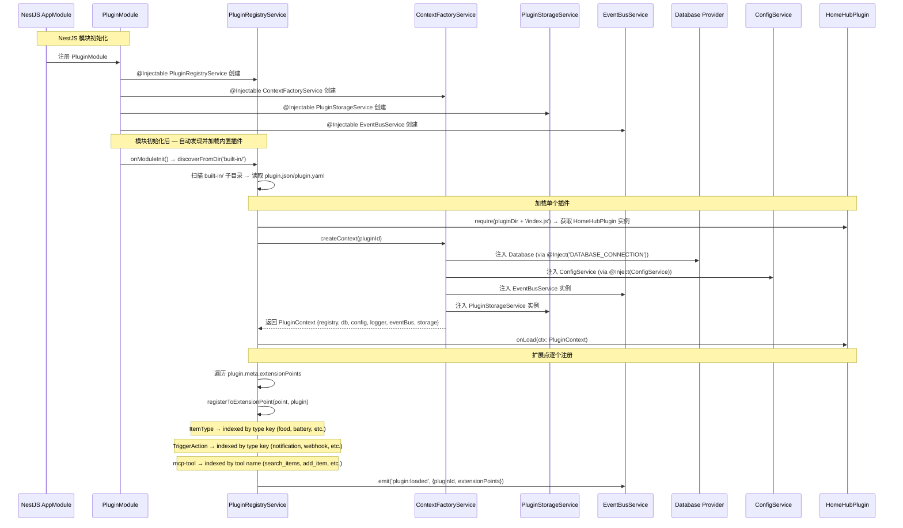
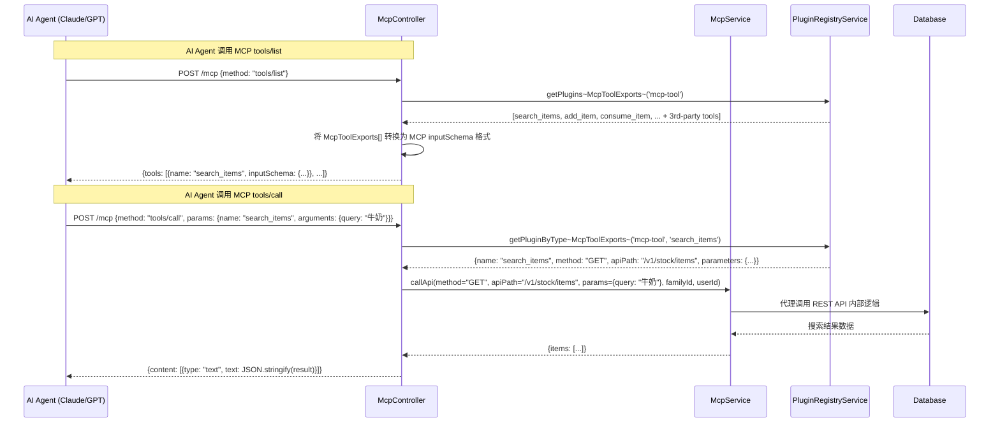
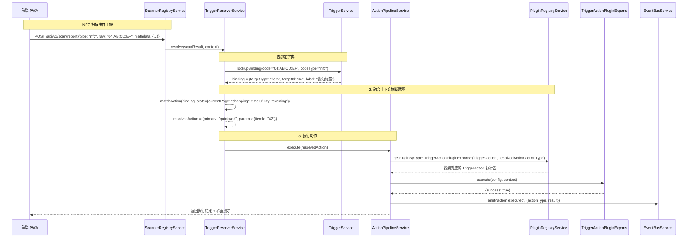
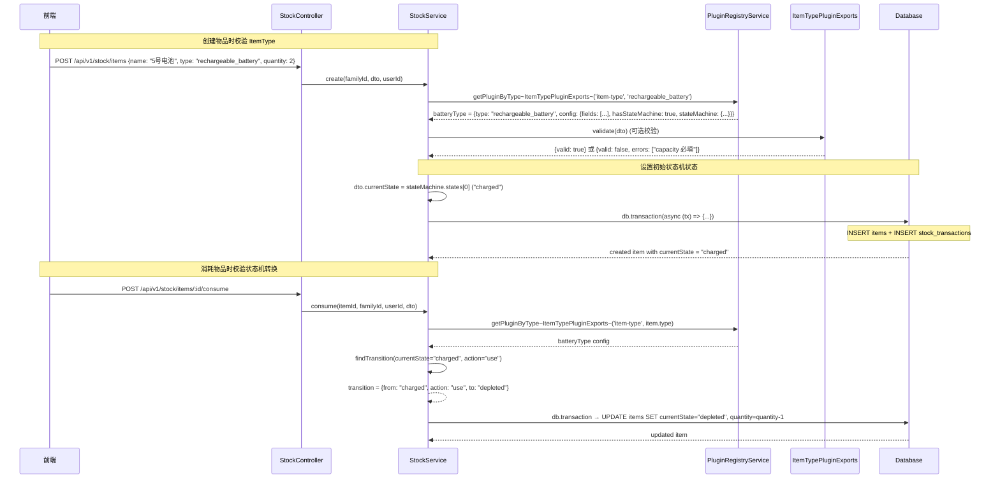
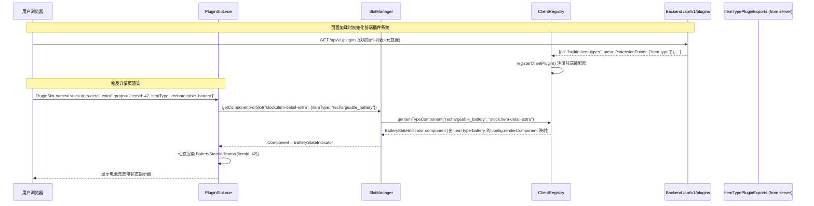
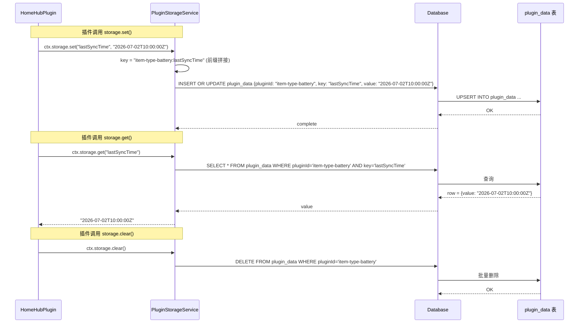
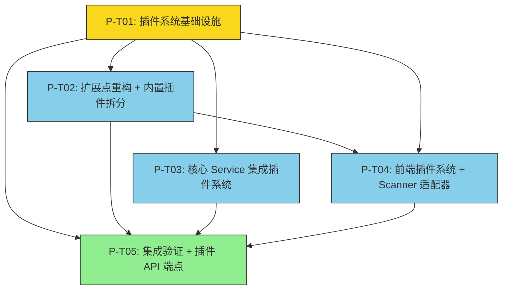

# HomeHub 插件系统重构架构方案

> **架构师**: 高见远（Gao）· Architect  
> **日期**: 2026-07-02  
> **版本**: v1.0  
> **依据**: HomeHub-PRD v1.5, HomeHub-Plugin-Arch v1.3, tech-review-2026-07-02  
> **约束**: Phase 0 — 仅同进程 JS 插件，多语言运行时（npx/uvx）延期至 Phase 1+

---

## Part A: 系统设计

### 1. 实现方案与框架选型

#### 1.1 核心技术挑战

| 挑战 | 当前问题 | 目标方案 |
|------|---------|---------|
| **PluginContext DI 注入** | `createContext()` 内联 mock：`db: null`, `config: process.env[key]`, `storage: Map` | NestJS Provider 注入真实 `Database`, `ConfigService`, `PluginStorageService` |
| **MCP 工具动态收集** | `McpController.getToolsList()` 硬编码 15 个工具 + switch-case 路由 | 从 `mcp-tool` 扩展点动态收集 McpToolExports，注册表驱动 dispatch |
| **Scanner 前后端分离** | `scanner-nfc/index.ts` 引用 `window/NDEFReader`，`scanner-barcode` 引用 `navigator.mediaDevices` — 浏览器 API 在服务端报错 | 前端 Scanner 适配器放 `client/src/plugins/scanner/`，后端仅保留 `scanner-registry.service.ts` 路由层 |
| **ItemType 扩展点注册** | `exports.types = allTypes` 数组整体注册，`StockService` 不查询 PluginRegistry | 每个 ItemType 逐个注册到 `item-type` 扩展点；StockService 通过 `registry.getPlugin<ItemTypePluginExports>('item-type', itemType)` 获取配置 |
| **TriggerAction 硬编码** | `resolveAction()` 使用 `actionMap[targetType][codeType]` 硬编码路由 | TriggerService 查询 `trigger-action` 扩展点获取可用动作执行器，通过 `registry.getPlugins<TriggerActionPluginExports>('trigger-action')` 动态路由 |
| **前端 PluginSlot** | 完全缺失 — 无 PluginSlot.vue、无 ClientRegistry、无 SlotManager | 实现前端插件系统：PluginSlot.vue + SlotManager + ClientRegistry，支持 ItemType renderComponent 和 Scanner 前端适配器 |
| **PluginStorage 持久化** | `private storageData = new Map<string, any>()` 纯内存，重启丢失 | Drizzle Schema 新增 `plugin_data` 表，PluginStorageService 提供 `get/set/delete/clear` 带前缀隔离 |
| **插件发现/安装** | 仅 `discoverFromDir()` 读 `plugin.json`，无 npm 安装、无市场 API | Phase 0 仅完善 discoverFromDir + YAML 支持；Phase 1 引入 npm 安装 |

#### 1.2 架构模式

采用 **NestJS Provider + Registry Pattern + EventBus Decoupling** 三层架构：

1. **NestJS Module Layer**: PluginModule 作为编排层，通过 DI 注入 Database/ConfigService/EventBusService 等 Provider 给 PluginContext
2. **Registry Pattern Layer**: PluginRegistryService 管理扩展点注册/查询，Service 层通过 Registry 获取插件能力而非硬编码
3. **EventBus Decoupling Layer**: 插件间通过 EventBus 通信，核心模块通过事件监听触发业务逻辑

#### 1.3 关键设计决策

| 决策 | 选择 | 原因 |
|------|------|------|
| PluginContext 工厂 | NestJS Injectable Provider 注入 | 利用 NestJS DI 体系，避免手动 mock；注入的真实 Service 可自动获取 scoped 生命周期 |
| 扩展点注册粒度 | 逐个注册（每个 ItemType/TriggerAction 单独注册） | 匹配 Plugin-Arch 的 `getPlugins<T>(point)` 查询模型，而非 `exports.types[]` 扁平数组 |
| MCP 工具收集 | `McpController` → `PluginRegistryService.getPlugins<McpToolExports>('mcp-tool')` 动态收集 | 消除硬编码 switch-case，支持第三方插件注册新 MCP 工具 |
| Scanner 分离策略 | 后端仅保留 Registry + WebSocket 推送，前端放完整 Web NFC/Barcode 适配器 | 浏览器 API 无法在 Node.js 运行；RFID MQTT 后端适配器 Phase 1 实现 |
| PluginStorage | Drizzle `plugin_data` 表 + PluginStorageService | 数据持久化，支持按 `pluginId:key` 前缀隔离 |
| 配置文件格式 | 支持 `plugin.json` + `plugin.yaml` | YAML 更适合人类编辑复杂配置（configSchema/permissions）；JSON 保持向后兼容 |

---

### 2. 文件列表

#### 2.1 后端 — 重构/修改

| 文件路径 | 变更类型 | 说明 |
|---------|---------|------|
| `server/src/plugins/types/plugin.types.ts` | **重构** | PluginContext.db 改为 `Database` 类型，ConfigService/Logger/EventBus 改为 NestJS 真实接口；新增 `ClientPluginExports` 前端契约 |
| `server/src/plugins/registry/plugin-registry.service.ts` | **重构** | `createContext()` 改为 NestJS Provider 注入；扩展点注册改为逐个注册（ItemType 按 type key 索引）；新增 `getPluginByType()` 方法 |
| `server/src/plugins/core/event-bus.service.ts` | **修改** | 添加 `once/removeAllListeners` 已存在，需添加事件类型白名单校验 |
| `server/src/plugins/built-in/mcp-server/index.ts` | **重构** | 从 `exports.tools` 数组改为逐个注册到 `mcp-tool` 扩展点；移除整体数组导出 |
| `server/src/plugins/built-in/item-types/index.ts` | **重构** | 从 `exports.types` 数组改为逐个注册到 `item-type` 扩展点；每个 ItemType 单独注册 |
| `server/src/plugins/built-in/trigger-actions/index.ts` | **重构** | 从 `exports.actions` 数组改为逐个注册到 `trigger-action` 扩展点；每个 TriggerAction 单独注册 |
| `server/src/plugins/built-in/scanner-nfc/index.ts` | **移除** | 移除到 `client/src/plugins/scanner/`；后端仅保留 NFC 事件处理注册 |
| `server/src/plugins/built-in/scanner-barcode/index.ts` | **移除** | 移除到 `client/src/plugins/scanner/`；后端仅保留 Barcode 事件处理注册 |
| `server/src/modules/trigger/trigger.service.ts` | **重构** | `resolveAction()` 改为查询 PluginRegistry 获取可用 TriggerAction 执行器；`handleScan()` 增强为 Resolver 上下文推断 + Pipeline 执行链 |
| `server/src/modules/mcp/mcp.controller.ts` | **重构** | `getToolsList()` 改为动态收集 from Registry；`executeTool()` 改为通用 dispatch（查找 tool → 调用 apiPath） |
| `server/src/modules/mcp/mcp.service.ts` | **重构** | 移除硬编码工具方法，改为通用 `callApi(method, path, params)` 代理调用 |
| `server/src/modules/stock/stock.service.ts` | **修改** | 添加 `getItemTypeConfig(itemType)` 方法查询 Registry 获取 ItemType 配置；consume/transfer 添加状态机校验 |

#### 2.2 后端 — 新增

| 文件路径 | 变更类型 | 说明 |
|---------|---------|------|
| `server/src/plugins/plugin.module.ts` | **新增** | NestJS Module 编排：注册 PluginRegistryService、EventBusService、PluginStorageService、ContextFactory |
| `server/src/plugins/core/context-factory.service.ts` | **新增** | NestJS Injectable，通过 DI 注入 Database/ConfigService/EventBusService/PluginStorageService，创建真实 PluginContext |
| `server/src/plugins/core/plugin-storage.service.ts` | **新增** | NestJS Injectable，基于 `plugin_data` Drizzle 表提供持久化存储，按 pluginId 前缀隔离 |
| `server/src/plugins/scanner/scanner-registry.service.ts` | **新增** | 后端 Scanner Registry — 接收前端 Scanner 事件（WebSocket/REST），路由到 TriggerResolver |
| `server/src/db/schema/plugin-data.ts` | **新增** | Drizzle Schema: `plugin_data { id, pluginId, key, value:text(json), createdAt, updatedAt }` |
| `server/src/plugins/types/client-plugin.types.ts` | **新增** | 前端插件契约定义：ClientPluginExports, PluginSlotPosition, ClientRegistry 接口 |
| `server/src/modules/trigger/resolver.service.ts` | **新增** | TriggerResolver — 上下文融合 + 意图推断，查询 TriggerBinding + 上下文（当前页面、用户角色、时间） |
| `server/src/modules/trigger/pipeline.service.ts` | **新增** | ActionPipeline — 标准化动作执行链，通过 PluginRegistry 获取 TriggerAction 执行器 |
| `server/src/plugins/built-in/mcp-server/tools/*.ts` | **新增** | 每个内置 MCP 工具拆为独立文件（search-items.ts, add-item.ts, consume-item.ts 等），独立注册到 mcp-tool 扩展点 |
| `server/src/plugins/built-in/item-types/food.ts` | **新增** | 食品类型单独注册文件 |
| `server/src/plugins/built-in/item-types/grocery.ts` | **新增** | 日用品类型单独注册文件 |
| `server/src/plugins/built-in/item-types/battery.ts` | **新增** | 充电电池类型单独注册文件 |
| `server/src/plugins/built-in/item-types/gas-tank.ts` | **新增** | 煤气罐类型单独注册文件 |
| `server/src/plugins/built-in/item-types/electronic-device.ts` | **新增** | 电子设备类型单独注册文件 |
| `server/src/plugins/built-in/item-types/fire-extinguisher.ts` | **新增** | 灭火器类型单独注册文件 |
| `server/src/plugins/built-in/trigger-actions/notification.ts` | **新增** | App内通知单独注册 |
| `server/src/plugins/built-in/trigger-actions/webhook.ts` | **新增** | Webhook 单独注册 |
| `server/src/plugins/built-in/trigger-actions/open-page.ts` | **新增** | 打开页面单独注册 |
| `server/src/plugins/built-in/trigger-actions/mcp-tool.ts` | **新增** | MCP调用单独注册 |

#### 2.3 前端 — 新增

| 文件路径 | 变更类型 | 说明 |
|---------|---------|------|
| `client/src/plugins/client-registry.ts` | **新增** | 前端插件注册中心 — 收集后端插件元数据 + 前端 ClientPluginExports |
| `client/src/plugins/slot-manager.ts` | **新增** | 插槽管理器 — 管理 PluginSlot 渲染，根据 item.type 匹配 ItemType renderComponent |
| `client/src/plugins/scanner/nfc-scanner.ts` | **新增** | Web NFC 前端适配器（从 server scanner-nfc 迁移） |
| `client/src/plugins/scanner/barcode-scanner.ts` | **新增** | QuaggaJS 条码扫描前端适配器（从 server scanner-barcode 迁移） |
| `client/src/components/PluginSlot.vue` | **新增** | 通用插槽容器组件 — 动态渲染注册到指定 slot position 的 Vue 组件 |
| `client/src/components/PluginSettings.vue` | **新增** | 插件配置页 — 根据 plugin.configSchema JSON Schema 自动生成表单 |
| `client/src/plugins/plugin-loader.ts` | **新增** | 前端插件加载器 — 从后端 `/api/v1/plugins` 获取插件列表 + 前端适配器映射 |

#### 2.4 前端 — 修改

| 文件路径 | 变更类型 | 说明 |
|---------|---------|------|
| `client/src/views/stock/ItemDetail.vue` | **修改** | 添加 PluginSlot `stock:item-detail-extra` 和 `stock:item-actions` |
| `client/src/views/iot-tags/IoTTagsView.vue` | **修改** | 使用前端 Scanner 适配器替代硬编码 NFC 交互 |

---

### 3. 数据结构和接口（类图）

```mermaid
classDiagram

    %% === NestJS Module Layer ===
    class PluginModule {
        <<NestJS Module>>
        +providers: PluginRegistryService, ContextFactoryService, PluginStorageService, EventBusService
        +exports: PluginRegistryService, EventBusService, PluginStorageService
    }

    %% === Core Services ===
    class PluginRegistryService {
        -Map~string,PluginInstance~ plugins
        -Map~ExtensionPointType,Map~string,HomeHubPlugin~~ extensionPoints
        -ContextFactoryService contextFactory
        +discoverFromDir(dir: string) Promise~HomeHubPluginMeta[]~
        +load(plugin: HomeHubPlugin) Promise~void~
        +unload(pluginId: string) Promise~void~
        +getPlugins~T~(point: ExtensionPointType) T[]
        +getPluginByType~T~(point: ExtensionPointType, typeKey: string) T | null
        +getFirstPlugin~T~(point: ExtensionPointType) T | null
        +getPluginService(pluginId: string, serviceName: string) any
        +listPlugins() PluginInfo[]
    }

    class ContextFactoryService {
        <<NestJS Injectable>>
        -Database db
        -ConfigService configService
        -EventBusService eventBus
        -PluginStorageService storage
        +createContext(pluginId: string) PluginContext
    }

    class PluginStorageService {
        <<NestJS Injectable>>
        -Database db
        +get(pluginId: string, key: string) Promise~any~
        +set(pluginId: string, key: string, value: any) Promise~void~
        +delete(pluginId: string, key: string) Promise~void~
        +clear(pluginId: string) Promise~void~
    }

    class EventBusService {
        <<NestJS Injectable>>
        -Map~string,Set~EventHandler~~ handlers
        +emit(event: string, data: any) void
        +on(event: string, handler: EventHandler) ()=>void
        +off(event: string, handler: EventHandler) void
        +once(event: string, handler: EventHandler) ()=>void
    }

    %% === Plugin Context ===
    class PluginContext {
        +PluginRegistryService registry
        +Database db
        +ConfigService config
        +Logger logger
        +EventBusService eventBus
        +PluginStorageService storage
    }

    %% === Plugin Interfaces ===
    class HomeHubPlugin {
        <<interface>>
        +HomeHubPluginMeta meta
        +onLoad?(ctx: PluginContext) Promise~void~
        +onUnload?(ctx: PluginContext) Promise~void~
        +exports?: Record~string,any~
    }

    class HomeHubPluginMeta {
        +string id
        +string name
        +string version
        +string[] extensionPoints
        +PluginRuntime? runtime
        +Record~string,any~? configSchema
        +string[]? permissions
    }

    %% === Extension Point Contracts ===
    class ScannerPluginExports {
        <<interface>>
        +string type
        +string name
        +number priority
        +boolean supported
        +scan(options?: any) Promise~ScanResult~
        +listen(callback: ScanCallback) ()=>void
    }

    class ItemTypePluginExports {
        <<interface>>
        +string type
        +string name
        +string icon
        +ItemTypeConfig config
        +validate?(data: any) ValidationResult
    }

    class ItemTypeConfig {
        +FieldDef[] fields
        +boolean hasStateMachine
        +StateMachineDef? stateMachine
        +string[] features
        +string? defaultUnit
        +string? renderComponent
    }

    class McpToolExports {
        <<interface>>
        +string name
        +string description
        +string method
        +string apiPath
        +Record~string,ParamDef~? parameters
        +string? mapParams
    }

    class TriggerActionPluginExports {
        <<interface>>
        +string type
        +string name
        +execute(config: Record, context: ActionContext) Promise~ActionResult~
    }

    class OutputDevicePluginExports {
        <<interface>>
        +string type
        +string name
        +detect() Promise~DeviceInfo[]~
        +print(job: PrintJob) Promise~PrintResult~
    }

    %% === Trigger Resolver + Pipeline ===
    class TriggerResolverService {
        <<NestJS Injectable>>
        -PluginRegistryService registry
        -TriggerService triggerService
        +resolve(scan: ScanResult, context: ResolveContext) Promise~ResolvedAction~
        -lookupBinding(code: string, codeType: string) Promise~TriggerBinding~
        -matchAction(binding: TriggerBinding, state: ScanContext) ResolvedAction
    }

    class ActionPipelineService {
        <<NestJS Injectable>>
        -PluginRegistryService registry
        +execute(action: ResolvedAction) Promise~void~
        -findExecutor(actionType: string) TriggerActionPluginExports
    }

    %% === MCP Dynamic ===
    class McpController {
        -McpService mcpService
        -PluginRegistryService registry
        +handleRequest(auth, body) JSONRPCResponse
        +getToolsList() McpToolInfo[]
        +handleToolCall(id, params, user) JSONRPCResponse
    }

    class McpService {
        -Database db
        +callApi(method: string, path: string, params: any, familyId: number, userId: number) Promise~any~
        +validateToken(token: string) Promise~ApiTokenUser~
    }

    %% === Stock Integration ===
    class StockService {
        -Database db
        -PluginRegistryService registry
        +getItemTypeConfig(itemType: string) ItemTypePluginExports | null
        +validateStateMachineTransition(itemId: number, action: string) Promise~boolean~
    }

    %% === Frontend Plugin System ===
    class ClientRegistry {
        -Map~string,ClientPluginExports~ clientPlugins
        -Map~string,HomeHubPluginMeta~ serverPlugins
        +registerClientPlugin(pluginId: string, exports: ClientPluginExports) void
        +getSlotComponents(slotName: string) Component[]
        +getScannerAdapter(scannerType: string) ScannerPluginExports | null
    }

    class SlotManager {
        -ClientRegistry registry
        +getComponentForSlot(slotName: string, props: Record) Component | null
        +getItemTypeComponent(itemType: string, slotName: string) Component | null
    }

    class PluginSlotVue {
        <<Vue Component>>
        +string name
        +Record props
        +render() VNode
    }

    %% === Relationships ===
    PluginModule -- PluginRegistryService : provides
    PluginModule -- ContextFactoryService : provides
    PluginModule -- PluginStorageService : provides
    PluginModule -- EventBusService : provides

    ContextFactoryService -- PluginContext : creates
    ContextFactoryService ..> Database : injects
    ContextFactoryService ..> ConfigService : injects
    ContextFactoryService ..> EventBusService : injects
    ContextFactoryService ..> PluginStorageService : injects

    PluginRegistryService -- ContextFactoryService : uses to createContext
    PluginRegistryService ..> HomeHubPlugin : manages lifecycle
    PluginRegistryService ..> ExtensionPointType : registers per-point
    PluginRegistryService ..> ItemTypePluginExports : indexes by type key
    PluginRegistryService ..> TriggerActionPluginExports : indexes by type key
    PluginRegistryService ..> McpToolExports : indexes by tool name

    PluginContext -- PluginRegistryService : provides registry
    PluginContext ..> Database : provides db
    PluginContext ..> PluginStorageService : provides storage

    HomeHubPlugin -- HomeHubPluginMeta : has
    HomeHubPlugin ..> PluginContext : receives on onLoad

    TriggerResolverService -- PluginRegistryService : queries for TriggerAction
    TriggerResolverService -- TriggerService : queries for bindings
    ActionPipelineService -- PluginRegistryService : finds executor
    ActionPipelineService ..> TriggerActionPluginExports : calls execute()

    McpController -- PluginRegistryService : dynamic tool collection
    McpController ..> McpToolExports : collects from registry
    McpService ..> McpController : generic callApi proxy

    StockService -- PluginRegistryService : queries ItemType
    StockService ..> ItemTypePluginExports : validates + state machine

    ClientRegistry -- HomeHubPluginMeta : synced from server
    ClientRegistry ..> ClientPluginExports : manages frontend adapters
    SlotManager -- ClientRegistry : queries
    PluginSlotVue -- SlotManager : renders dynamic component
```



---

### 4. 程序调用流程（时序图）

#### 4.1 PluginContext DI 注入流程



#### 4.2 MCP 动态工具收集 + 调用流程



#### 4.3 Trigger Resolver + Action Pipeline 流程



#### 4.4 ItemType 与 StockService 联动流程



#### 4.5 前端 PluginSlot 渲染流程



#### 4.6 PluginStorage 持久化流程



---

### 5. 待明确事项（UNCLEAR）

1. **前端 Scanner 适配器如何与后端通信**: 前端 Web NFC/Barcode Scanner 适配器扫描结果如何上报到后端？选项：(a) REST API `/api/v1/scan/report` 直接上报 ScanResult；(b) WebSocket 实时推送。建议 Phase 0 用 REST API，Phase 1 加 WebSocket 实时推送。

2. **ItemType 单独注册 vs 批量注册**: 当前 `item-types` 插件将 6 个类型打包为 `exports.types` 数组。重构后每个类型独立注册，但 6 个类型是否仍在同一插件目录下（`built-in/item-types/`）只是每个类型单独文件？还是拆为 6 个独立插件目录？建议：**保持在同一目录，每个类型单独文件注册到 `item-type` 扩展点，插件 ID 仍为 `builtin.item-types`**。

3. **PluginStorage JSON 字段大小限制**: `plugin_data.value` 用 `text(json)` 存储，理论上 SQLite TEXT 无限但 PostgreSQL TEXT 实际也无限。是否需要限制单条 value 大小？建议：**Phase 0 不限制，Phase 1 加 1MB 上限校验**。

4. **MCP 工具动态 dispatch 的参数映射**: 当前 `McpService` 为每个工具有硬编码方法（`searchItems/addItem/consumeItem...`）。重构后 `callApi(method, apiPath, params)` 通用代理如何处理 path 参数替换（如 `/v1/stock/items/{item_id}/consume` 中的 `{item_id}`）？建议：**McpToolExports 增加 `pathParams` 字段列表，callApi 在调用前做参数替换**。

5. **前端 PluginSlot 的组件注册时机**: 前端组件（如 BatteryStateIndicator）是在构建时打包还是运行时动态加载？建议：**Phase 0 构建时打包所有内置插件组件；Phase 1 支持运行时 `defineAsyncComponent()` 动态加载社区插件组件**。

6. **TriggerResolver 的上下文数据来源**: ResolveContext 中 `currentPage/locationId/recentActions` 从前端上报还是后端推断？建议：**前端上报 context 到 `/api/v1/scan/report` 请求体中，后端 Resolver 融合 binding 数据 + 上报上下文**。

---

## Part B: 任务分解

### 6. 需要安装的包

```
# Server 新增（Phase 0）
- yaml@^2.4.0: 解析 plugin.yaml 配置文件（替代仅支持 JSON）
- js-yaml@^4.1.0: 备选 YAML 解析器

# Client 新增（Phase 0）
- @vueuse/core@^11.0.0: 异步状态管理 composable（已在前次重构计划中）
- quagga2@^1.8.0: 前端条码扫描库（QuaggaJS 继任）
```

### 7. 任务列表（有序、含依赖关系）

| Task-ID | 依赖 | 优先级 | 描述 | 涉及文件 | 验收标准 |
|---------|------|--------|------|---------|---------|
| **P-T01** | — | P0 | **插件系统基础设施** — PluginModule 编排 + ContextFactoryService (NestJS Provider 注入 Database/ConfigService/EventBusService/PluginStorageService) + PluginStorageService (plugin_data Drizzle 表持久化) + EventBusService 增强（事件白名单） + plugin.types.ts 重构（PluginContext.db 改为 Database 类型） + plugin.yaml 解析支持 | `server/src/plugins/plugin.module.ts`[新], `server/src/plugins/core/context-factory.service.ts`[新], `server/src/plugins/core/plugin-storage.service.ts`[新], `server/src/plugins/types/plugin.types.ts`[改], `server/src/db/schema/plugin-data.ts`[新], `server/src/plugins/core/event-bus.service.ts`[改], `server/src/plugins/registry/plugin-registry.service.ts`[改], `server/package.json`[改] | 1) PluginModule 正确注册所有 Provider；2) ContextFactoryService.createContext() 注入真实 Database/ConfigService/EventBusService/PluginStorageService（非 mock）；3) PluginStorageService 使用 plugin_data 表持久化，按 pluginId 前缀隔离；4) PluginRegistryService.load() 使用 ContextFactoryService 创建 PluginContext；5) discoverFromDir() 支持 plugin.yaml + plugin.json 双格式；6) extensionPoints 按 type key 索引（ItemType/TriggerAction/McpTool） |
| **P-T02** | P-T01 | P0 | **扩展点重构 + 内置插件拆分** — ItemType/TriggerAction/McpTool 从数组导出改为逐个注册到扩展点；McpServerPlugin 工具拆为独立文件；Scanner 前后端分离（移除 server scanner-nfc/scanner-barcode，新建 client Scanner 适配器）；后端新增 ScannerRegistryService + TriggerResolverService + ActionPipelineService | `server/src/plugins/built-in/item-types/food.ts`[新], `server/src/plugins/built-in/item-types/grocery.ts`[新], `server/src/plugins/built-in/item-types/battery.ts`[新], `server/src/plugins/built-in/item-types/gas-tank.ts`[新], `server/src/plugins/built-in/item-types/electronic-device.ts`[新], `server/src/plugins/built-in/item-types/fire-extinguisher.ts`[新], `server/src/plugins/built-in/item-types/index.ts`[改-注册方式], `server/src/plugins/built-in/trigger-actions/notification.ts`[新], `server/src/plugins/built-in/trigger-actions/webhook.ts`[新], `server/src/plugins/built-in/trigger-actions/open-page.ts`[新], `server/src/plugins/built-in/trigger-actions/mcp-tool.ts`[新], `server/src/plugins/built-in/trigger-actions/index.ts`[改-注册方式], `server/src/plugins/built-in/mcp-server/tools/*.ts`[新-15个独立文件], `server/src/plugins/built-in/mcp-server/index.ts`[改-逐个注册], `server/src/plugins/built-in/scanner-nfc/index.ts`[移除→client], `server/src/plugins/built-in/scanner-barcode/index.ts`[移除→client], `server/src/plugins/scanner/scanner-registry.service.ts`[新], `server/src/modules/trigger/resolver.service.ts`[新], `server/src/modules/trigger/pipeline.service.ts`[新] | 1) ItemType 6 个类型逐个注册到 `item-type` 扩展点（`registry.getPluginByType('item-type', 'food')` 返回 food ItemType）；2) TriggerAction 4 个动作逐个注册；3) MCP 工具 15 个逐个注册到 `mcp-tool` 扩展点；4) scanner-nfc/scanner-barcode 从 server 移除，window/NDEFReader/navigator 引用不再存在于后端代码；5) ScannerRegistryService 接收前端上报的 ScanResult REST API；6) TriggerResolverService 实现 resolve(scan, context) 上下文推断；7) ActionPipelineService 通过 Registry 查询 TriggerAction 执行器 |
| **P-T03** | P-T01 | P0 | **核心 Service 集成插件系统** — StockService.getItemTypeConfig() 查询 Registry + 状态机校验；TriggerService.resolveAction() 改为查询 Registry 获取 TriggerAction 执行器；McpController.getToolsList() 改为动态收集 + callApi 通用代理；McpService 移除硬编码方法 | `server/src/modules/stock/stock.service.ts`[改], `server/src/modules/trigger/trigger.service.ts`[改], `server/src/modules/mcp/mcp.controller.ts`[改], `server/src/modules/mcp/mcp.service.ts`[改], `server/src/modules/trigger/trigger.module.ts`[改], `server/src/modules/mcp/mcp.module.ts`[改], `server/src/modules/stock/stock.module.ts`[改] | 1) StockService.create() 查询 Registry 获取 ItemType 配置，设置初始状态机状态；2) StockService.consume() 校验状态机转换合法性；3) TriggerService.resolveAction() 不使用硬编码 actionMap，通过 Registry 查询 TriggerAction；4) TriggerService.handleScan() 使用 TriggerResolverService.resolve()；5) McpController.getToolsList() 动态从 Registry 收集；6) McpController.executeTool() 不使用 switch-case，改为查找 tool → callApi 代理；7) 所有涉及插件的 Module 注入 PluginRegistryService |
| **P-T04** | P-T02 | P1 | **前端插件系统 + Scanner 适配器** — ClientRegistry + SlotManager + PluginSlot.vue + PluginSettings.vue + NFC/Barcode 前端适配器 + ItemDetail PluginSlot 集成 + IoTTagsView Scanner 适配器集成 | `client/src/plugins/client-registry.ts`[新], `client/src/plugins/slot-manager.ts`[新], `client/src/plugins/plugin-loader.ts`[新], `client/src/plugins/scanner/nfc-scanner.ts`[新], `client/src/plugins/scanner/barcode-scanner.ts`[新], `client/src/components/PluginSlot.vue`[新], `client/src/components/PluginSettings.vue`[新], `client/src/views/stock/ItemDetail.vue`[改], `client/src/views/iot-tags/IoTTagsView.vue`[改], `client/src/plugins/types/client-plugin.types.ts`[新], `client/package.json`[改] | 1) ClientRegistry 初始化时从 `/api/v1/plugins` 获取后端插件元数据；2) SlotManager 根据 itemType 匹配 renderComponent；3) PluginSlot.vue 动态渲染注册组件；4) NFC Scanner 前端适配器使用 Web NFC API 在浏览器端工作；5) Barcode Scanner 前端适配器使用 QuaggaJS 扫码；6) ItemDetail 页面渲染 ItemType 扩展区域 + 状态机操作按钮；7) IoTTagsView 使用前端 Scanner 适配器 + 上报 ScanResult 到后端 |
| **P-T05** | P-T01, P-T02, P-T03, P-T04 | P1 | **集成验证 + 插件 API 端点** — Plugins Module 全局注册 + 插件管理 REST API（GET/POST/PUT/DELETE /api/v1/plugins）+ E2E 验证关键流程（MCP 动态工具、ItemType 联动、Trigger 动态路由、Scanner 前端上报） | `server/src/plugins/plugins.controller.ts`[新], `server/src/plugins/plugins.service.ts`[新], `server/src/app.module.ts`[改], `server/src/main.ts`[改], `client/src/stores/plugin.store.ts`[新], `client/src/router/index.ts`[改-插件管理路由] | 1) GET /api/v1/plugins 返回已安装插件列表（含 status/extensionPoints）；2) POST /api/v1/plugins/:id/enable/disable 启用/禁用插件；3) GET /api/v1/plugins/discover 扫描目录发现新插件；4) MCP tools/list 动态返回所有注册工具（含第三方）；5) ItemType 联动全链路（创建物品→查 ItemType→设状态机→前端渲染）；6) Trigger 全链路（前端扫描→上报→Resolver→Pipeline→Action 执行）；7) PluginStorage 持久化重启后不丢失 |

### 8. 共享知识（跨文件约定）

#### 8.1 扩展点索引约定

```
PluginRegistryService 的 extensionPoints 内部存储结构:
  Map<ExtensionPointType, Map<string, HomeHubPlugin>>

  其中:
  - 'item-type' → Map<typeKey, HomeHubPlugin>    (typeKey = "food", "battery", etc.)
  - 'trigger-action' → Map<typeKey, HomeHubPlugin> (typeKey = "notification", "webhook", etc.)
  - 'mcp-tool' → Map<toolName, HomeHubPlugin>     (toolName = "search_items", "add_item", etc.)
  - 'scanner' → Map<scannerType, HomeHubPlugin>   (scannerType = "nfc", "barcode", etc.)

  查询方法:
  - getPlugins<T>(point) → 返回所有已注册插件的 exports
  - getPluginByType<T>(point, typeKey) → 返回特定 typeKey 的 exports
  - getFirstPlugin<T>(point) → 按 priority 返回最高优先级
```

#### 8.2 PluginContext DI 注入约定

```typescript
// ContextFactoryService.createContext(pluginId)
// 所有 Provider 通过 NestJS DI 注入，非手动 mock

@Injectable()
export class ContextFactoryService {
  constructor(
    @Inject('DATABASE_CONNECTION') private readonly db: Database,
    private readonly configService: ConfigService,
    private readonly eventBus: EventBusService,
    private readonly storage: PluginStorageService,
  ) {}

  createContext(pluginId: string): PluginContext {
    return {
      registry: this.registry,      // PluginRegistryService 实例
      db: this.db,                  // 真实 Database 连接（受限访问）
      config: this.configService,   // 真实 NestJS ConfigService
      logger: new Logger(`Plugin:${pluginId}`),  // NestJS Logger 带插件前缀
      eventBus: this.eventBus,      // 真实 EventBusService 实例
      storage: this.storage.forPlugin(pluginId),  // PluginStorageService 前缀隔离实例
    };
  }
}
```

#### 8.3 PluginStorage 数据隔离约定

```
plugin_data 表结构:
  id: integer PK auto-increment
  pluginId: text NOT NULL  (插件ID，如 "builtin.item-types")
  key: text NOT NULL       (插件内部 key，如 "lastSyncTime")
  value: text(json)        (JSON 值，支持任意结构)
  createdAt: datetime
  updatedAt: datetime

  索引: UNIQUE(pluginId, key)  — 防止同一插件同一 key 重复

  隔离规则:
  - PluginStorageService.forPlugin(pluginId) 返回 scoped 实例
  - scoped.get(key) → 查 pluginId+key
  - scoped.set(key, value) → UPSERT pluginId+key
  - scoped.delete(key) → DELETE WHERE pluginId AND key
  - scoped.clear() → DELETE WHERE pluginId (清除插件全部数据)
```

#### 8.4 MCP 工具动态 dispatch 约定

```typescript
// McpService 通用代理
async callApi(method: string, apiPath: string, params: Record<string, any>,
              familyId: number, userId: number): Promise<any> {
  // 1. 路径参数替换: apiPath 中的 {item_id} → params.item_id
  const resolvedPath = apiPath.replace(/\{(\w+)\}/g, (_, key) => params[key]);

  // 2. 分离 path params 和 body params
  const pathParams = extractPathParams(apiPath, params);
  const bodyParams = omit(params, Object.keys(pathParams));

  // 3. 调用对应 Service 方法（通过内部 Service 方法映射表）
  return this.serviceDispatcher.dispatch(method, resolvedPath, bodyParams, familyId, userId);
}
```

#### 8.5 前端插件组件映射约定

```
ItemType config.renderComponent 映射规则:
  "BatteryStateIndicator" → client/src/plugins/built-in/components/BatteryStateIndicator.vue
  "GasTankStateIndicator" → client/src/plugins/built-in/components/GasTankStateIndicator.vue

  映射表在 client/src/plugins/client-registry.ts 中维护:
  const componentMap = {
    'BatteryStateIndicator': () => import('../built-in/components/BatteryStateIndicator.vue'),
    'GasTankStateIndicator': () => import('../built-in/components/GasTankStateIndicator.vue'),
  }

  PluginSlot 渲染时:
  <PluginSlot name="stock:item-detail-extra" :props="{itemId, itemType}">
  → SlotManager 查 itemType → config.renderComponent
  → ClientRegistry 查 componentMap → defineAsyncComponent() 动态加载
```

#### 8.6 Scanner 前端上报约定

```
前端 Scanner 适配器扫描结果上报:
  POST /api/v1/scan/report
  Body: {
    code: "04:AB:CD:EF",       // NFC UID / 条码号 / QR 内容
    codeType: "nfc",            // nfc | qr | barcode | rfid
    metadata: {...},            // NDEF records / barcode format / etc.
    context: {                  // 前端上下文（Resolver 使用）
      pagePath: "/stock/items", // 用户当前页面
      locationId: null,         // 用户已知位置
      recentActions: []         // 最近操作序列
    }
  }

  后端 ScannerRegistryService 接收 → 调用 TriggerResolverService.resolve()
```

### 9. 任务依赖图



**关键路径**: P-T01 → P-T02 → P-T04 → P-T05

**并行路径**: P-T03 可与 P-T02/P-T04 并行（仅依赖 P-T01 的基础设施）

---

## 附录：关键代码示例

### A1: ContextFactoryService DI 注入

```typescript
// server/src/plugins/core/context-factory.service.ts
import { Injectable, Inject, Logger } from '@nestjs/common';
import { ConfigService } from '@nestjs/config';
import { Database } from '../../db/types';
import { EventBusService } from './event-bus.service';
import { PluginStorageService } from './plugin-storage.service';
import { PluginRegistryService } from '../registry/plugin-registry.service';

@Injectable()
export class ContextFactoryService {
  constructor(
    @Inject('DATABASE_CONNECTION') private readonly db: Database,
    private readonly configService: ConfigService,
    private readonly eventBus: EventBusService,
    private readonly storage: PluginStorageService,
    private readonly registry: PluginRegistryService,
  ) {}

  createContext(pluginId: string): PluginContext {
    return {
      registry: this.registry,
      db: this.createScopedDb(pluginId),
      config: this.configService,
      logger: new Logger(`Plugin:${pluginId}`),
      eventBus: this.eventBus,
      storage: this.storage.forPlugin(pluginId),
    };
  }

  // 创建受限 DB 访问（插件只能操作自己前缀的表和 trigger_bindings/nfc_tag_state）
  private createScopedDb(pluginId: string): Database {
    // Phase 0: 插件获得完整 db 访问（信任内置插件）
    // Phase 1: 添加沙箱限制 — 只允许 plugin_data 表 + trigger_bindings/nfc_tag_state
    return this.db;
  }
}
```

### A2: PluginStorageService 持久化

```typescript
// server/src/plugins/core/plugin-storage.service.ts
import { Injectable, Inject } from '@nestjs/common';
import { eq, and } from 'drizzle-orm';
import { Database } from '../../db/types';
import { pluginData } from '../../db/schema/plugin-data';

@Injectable()
export class PluginStorageService {
  constructor(
    @Inject('DATABASE_CONNECTION') private readonly db: Database,
  ) {}

  forPlugin(pluginId: string): ScopedPluginStorage {
    return new ScopedPluginStorage(pluginId, this.db);
  }
}

class ScopedPluginStorage implements PluginStorage {
  constructor(private readonly pluginId: string, private readonly db: Database) {}

  async get(key: string): Promise<any> {
    const row = await this.db.select().from(pluginData)
      .where(and(eq(pluginData.pluginId, this.pluginId), eq(pluginData.key, key)))
      .get();
    return row?.value ?? null;
  }

  async set(key: string, value: any): Promise<void> {
    await this.db.insert(pluginData)
      .values({ pluginId: this.pluginId, key, value })
      .onConflictDoUpdate({ target: [pluginData.pluginId, pluginData.key], set: { value, updatedAt: new Date() } })
      .run();
  }

  async delete(key: string): Promise<void> {
    await this.db.delete(pluginData)
      .where(and(eq(pluginData.pluginId, this.pluginId), eq(pluginData.key, key)))
      .run();
  }

  async clear(): Promise<void> {
    await this.db.delete(pluginData)
      .where(eq(pluginData.pluginId, this.pluginId))
      .run();
  }
}
```

### A3: PluginRegistryService 逐个注册 + 按类型查询

```typescript
// server/src/plugins/registry/plugin-registry.service.ts (重构后)

@Injectable()
export class PluginRegistryService {
  private plugins: Map<string, PluginInstance> = new Map();
  // 改为双层 Map: ExtensionPointType → typeKey → HomeHubPlugin
  private extensionPoints: Map<ExtensionPointType, Map<string, HomeHubPlugin>> = new Map();

  constructor(
    private readonly contextFactory: ContextFactoryService,
    private readonly eventBus: EventBusService,
  ) {}

  async load(plugin: HomeHubPlugin): Promise<void> {
    const { id } = plugin.meta;
    if (this.plugins.has(id)) return;

    try {
      // 使用 ContextFactory 注入真实 DI Provider
      if (plugin.onLoad) {
        await plugin.onLoad(this.contextFactory.createContext(id));
      }

      // 逐个注册到扩展点（而非整体数组）
      for (const point of plugin.meta.extensionPoints) {
        this.registerToExtensionPoint(point as ExtensionPointType, plugin);
      }

      this.plugins.set(id, { plugin, status: 'active', loadedAt: new Date() });
      this.eventBus.emit('plugin:loaded', { pluginId: id });
    } catch (error) {
      this.plugins.set(id, { plugin, status: 'error', error: error.message });
      this.eventBus.emit('plugin:error', { pluginId: id, error: error.message });
    }
  }

  private registerToExtensionPoint(point: ExtensionPointType, plugin: HomeHubPlugin): void {
    if (!this.extensionPoints.has(point)) {
      this.extensionPoints.set(point, new Map());
    }

    const pointMap = this.extensionPoints.get(point)!;

    // 根据扩展点类型提取 typeKey 用于索引
    switch (point) {
      case 'item-type':
        // exports 可能是单个 ItemType 或多个
        const itemTypes = this.extractItemTypes(plugin);
        for (const it of itemTypes) {
          pointMap.set(it.type, plugin);
        }
        break;
      case 'trigger-action':
        const actions = this.extractTriggerActions(plugin);
        for (const act of actions) {
          pointMap.set(act.type, plugin);
        }
        break;
      case 'mcp-tool':
        const tools = this.extractMcpTools(plugin);
        for (const tool of tools) {
          pointMap.set(tool.name, plugin);
        }
        break;
      case 'scanner':
        const scanner = this.extractScanner(plugin);
        if (scanner) {
          pointMap.set(scanner.type, plugin);
        }
        break;
      default:
        // 其他扩展点按 pluginId 索引
        pointMap.set(plugin.meta.id, plugin);
    }
  }

  // 按类型查询
  getPluginByType<T>(point: ExtensionPointType, typeKey: string): T | null {
    const pointMap = this.extensionPoints.get(point);
    if (!pointMap) return null;
    const plugin = pointMap.get(typeKey);
    if (!plugin || this.plugins.get(plugin.meta.id)?.status !== 'active') return null;
    return this.extractExportsByPoint<T>(point, plugin);
  }

  // 获取所有已注册的 exports
  getPlugins<T>(point: ExtensionPointType): T[] {
    const pointMap = this.extensionPoints.get(point);
    if (!pointMap) return [];
    const result: T[] = [];
    for (const [_, plugin] of pointMap) {
      if (this.plugins.get(plugin.meta.id)?.status === 'active') {
        const exports = this.extractExportsByPoint<T>(point, plugin);
        if (exports) result.push(exports);
      }
    }
    return result;
  }

  // 提取特定扩展点的 exports（按扩展点契约类型）
  private extractItemTypes(plugin: HomeHubPlugin): ItemTypePluginExports[] {
    const exports = plugin.exports;
    if (!exports) return [];
    // 支持两种注册方式: exports 直接是 ItemType 或 exports.types 是数组
    if (exports.type && exports.config) return [exports as ItemTypePluginExports];
    if (Array.isArray(exports.types)) return exports.types as ItemTypePluginExports[];
    return [];
  }

  private extractTriggerActions(plugin: HomeHubPlugin): TriggerActionPluginExports[] {
    const exports = plugin.exports;
    if (!exports) return [];
    if (exports.type && exports.execute) return [exports as TriggerActionPluginExports];
    if (Array.isArray(exports.actions)) return exports.actions as TriggerActionPluginExports[];
    return [];
  }

  private extractMcpTools(plugin: HomeHubPlugin): McpToolExports[] {
    const exports = plugin.exports;
    if (!exports) return [];
    if (exports.name && exports.apiPath) return [exports as McpToolExports];
    if (Array.isArray(exports.tools)) return exports.tools as McpToolExports[];
    return [];
  }

  private extractScanner(plugin: HomeHubPlugin): ScannerPluginExports | null {
    const exports = plugin.exports;
    if (!exports) return null;
    if (exports.type && exports.scan) return exports as ScannerPluginExports;
    return null;
  }
}
```

### A4: McpController 动态工具收集

```typescript
// server/src/modules/mcp/mcp.controller.ts (重构后)

@Controller('mcp')
export class McpController {
  constructor(
    private readonly mcpService: McpService,
    private readonly registry: PluginRegistryService,
  ) {}

  private getToolsList() {
    // 从 Registry 动态收集所有 mcp-tool 扩展点
    const toolExports = this.registry.getPlugins<McpToolExports>('mcp-tool');

    return toolExports.map(tool => ({
      name: tool.name,
      description: tool.description,
      inputSchema: this.buildInputSchema(tool.parameters),
    }));
  }

  private async executeTool(id: string | number, name: string, args: Record<string, any>,
                            familyId: number, userId: number) {
    // 从 Registry 查找特定工具
    const tool = this.registry.getPluginByType<McpToolExports>('mcp-tool', name);
    if (!tool) {
      throw new Error(`未知工具: ${name}`);
    }

    // 通用 API 代理调用
    return this.mcpService.callApi(tool.method, tool.apiPath, args, familyId, userId);
  }

  private buildInputSchema(parameters?: Record<string, any>) {
    if (!parameters) return { type: 'object', properties: {} };
    const properties: Record<string, any> = {};
    const required: string[] = [];

    for (const [key, param] of Object.entries(parameters)) {
      properties[key] = { type: param.type, description: param.description };
      if (param.enum) properties[key].enum = param.enum;
      if (!param.optional) required.push(key);
    }

    return { type: 'object', properties, required: required.length > 0 ? required : undefined };
  }
}
```

### A5: TriggerResolverService 上下文推断

```typescript
// server/src/modules/trigger/resolver.service.ts

@Injectable()
export class TriggerResolverService {
  constructor(
    private readonly triggerService: TriggerService,
    private readonly registry: PluginRegistryService,
  ) {}

  async resolve(scan: ScanResult, context: ResolveContext): Promise<ResolvedAction> {
    // 1. 查绑定字典
    const binding = await this.triggerService.lookupBinding(scan.raw, scan.type);
    if (!binding) {
      return this.handleUnknownCode(scan, context);
    }

    // 2. 融合上下文推断意图
    const state = {
      currentPage: context.pagePath,
      timeOfDay: this.getTimeSlot(),
      recentActions: context.recentActions || [],
    };

    // 3. 匹配动作 — 基于 targetType + 上下文
    return this.matchAction(binding, state, scan.type);
  }

  private matchAction(binding: any, state: ScanContext, codeType: string): ResolvedAction {
    // 基础动作由 targetType 决定
    const primaryActions: Record<string, string> = {
      item: 'showDetail',
      location: 'viewLocation',
      recipe: 'showDetail',
      action: 'triggerAction',
    };

    // 上下文覆盖：同一物品在购物清单页→入库
    if (state.currentPage?.includes('shopping') && binding.targetType === 'item') {
      return { primary: 'quickAdd', params: { itemId: binding.targetId } };
    }

    // 条码在库存页→添加物品
    if (codeType === 'barcode' && state.currentPage?.includes('stock')) {
      return { primary: 'quickAdd', params: { barcode: binding.code } };
    }

    return {
      primary: primaryActions[binding.targetType] || 'showDetail',
      params: { entityId: binding.targetId },
    };
  }
}
```

### A6: plugin_data Drizzle Schema

```typescript
// server/src/db/schema/plugin-data.ts
import { sqliteTable, text, integer } from 'drizzle-orm/sqlite-core';

export const pluginData = sqliteTable('plugin_data', {
  id: integer('id').primaryKey({ autoIncrement: true }),
  pluginId: text('plugin_id').notNull(),
  key: text('key').notNull(),
  value: text('value', { mode: 'json' }),  // JSON 字符串，SQLite TEXT / PG JSONB
  createdAt: text('created_at').notNull().$defaultFn(() => new Date().toISOString()),
  updatedAt: text('updated_at').notNull().$defaultFn(() => new Date().toISOString()),
});
```
