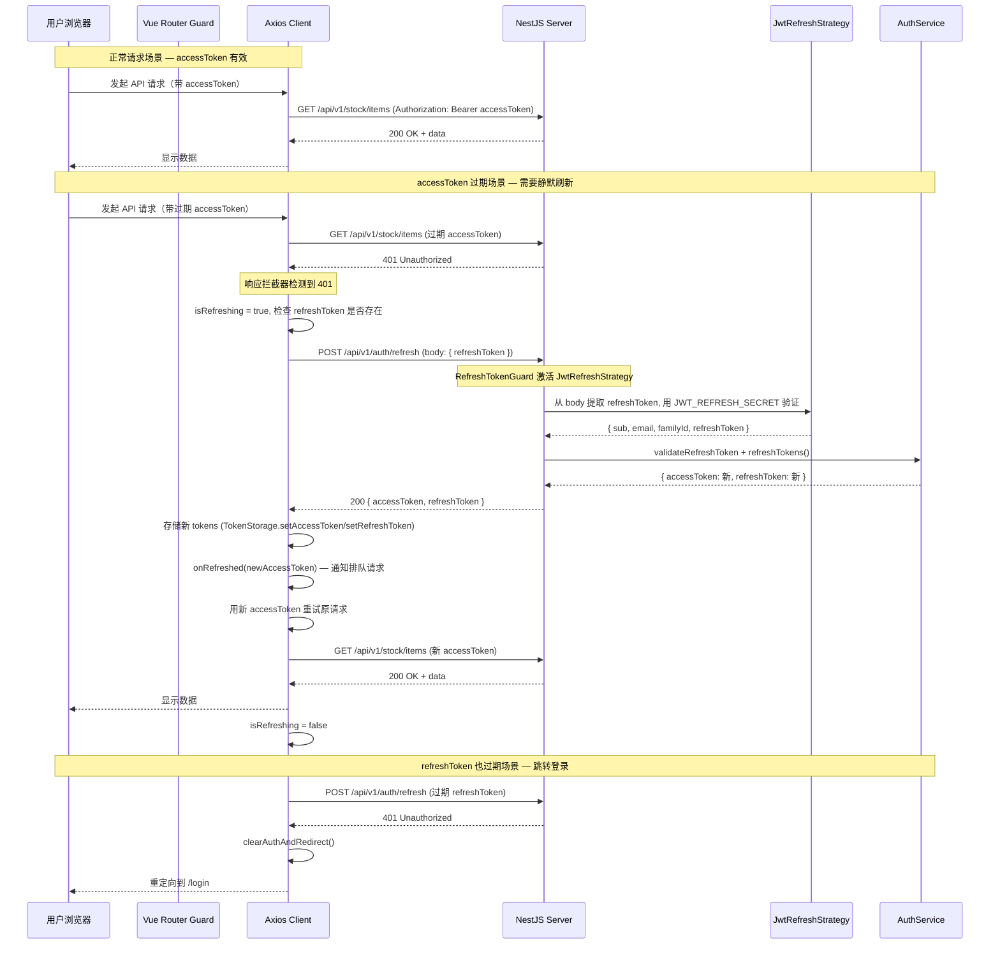
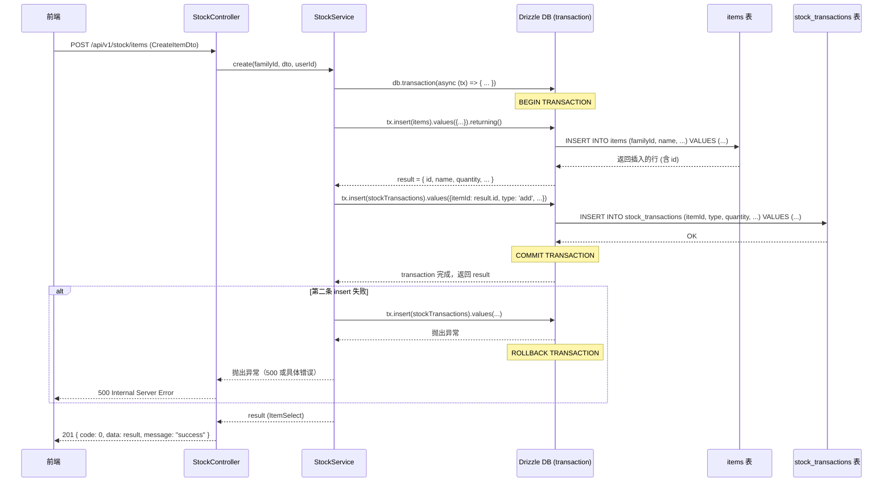
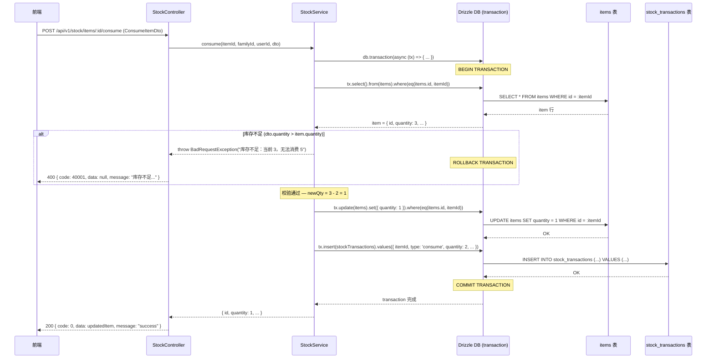
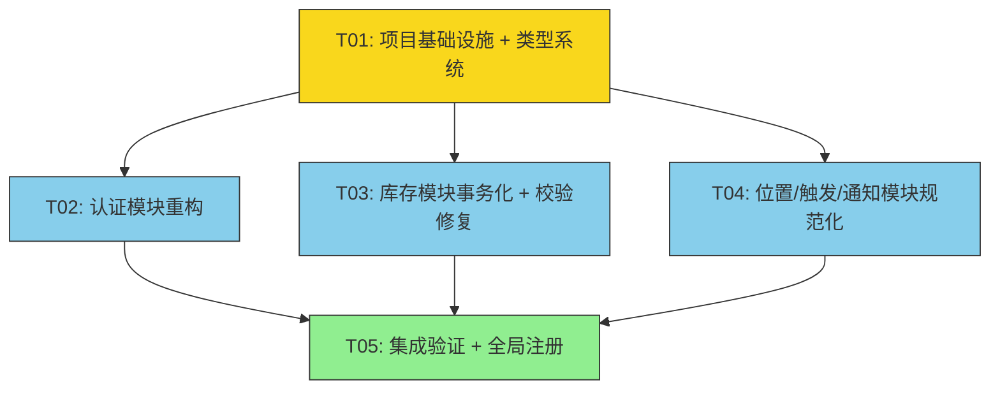

# HomeHub 重构架构设计方案 + 任务分解

> **架构师**: 高见远（Gao）· Architect  
> **日期**: 2026-07-02  
> **版本**: v1.0  
> **依据**: HomeHub-PRD v1.5, HomeHub-Tech-Spec v1.4, tech-review-2026-07-02

---

## Part A: 系统设计

### 1. 实现方案与框架选型

#### 1.1 技术栈确认（不变）

保持 PRD 规定的技术栈不变，重构聚焦于**代码质量与架构规范**而非技术栈切换：

| 层面 | 技术 | 版本 |
|------|------|------|
| 后端框架 | NestJS | >= 11.0 |
| ORM | Drizzle ORM | >= 0.40 |
| 数据库 | PostgreSQL（主推）/ SQLite（单用户备选） | — |
| 前端框架 | Vue 3 + Vite | >= 3.5 / >= 6.0 |
| UI 组件库 | Naive UI | >= 2.40 |
| 状态管理 | Pinia | >= 2.2 |
| 认证 | @nestjs/jwt + @nestjs/passport | JWT 双 Token |

#### 1.2 新增依赖包

| 包名 | 用途 | 安装位置 |
|------|------|---------|
| `drizzle-orm` (已有，需升级) | Transaction API 统一支持（SQLite/PG） | server |
| `better-sqlite3` (已有) | SQLite 驱动，支持同步事务 | server |
| `pg` (已有) | PostgreSQL 驱动 | server |
| `@types/better-sqlite3` (已有) | TypeScript 类型 | server |
| `class-transformer` (需新增) | DTO 响应序列化/反序列化，配合 class-validator | server |
| `@nestjs/passport` (已有) | Auth Guard 策略框架 | server |
| `passport-jwt` (已有) | JWT 策略实现 | server |
| `rxjs` (已有) | NestJS 内置 Observable | server |
| `crypto-js` (需新增) | 前端 Token 加密存储（替代裸 localStorage） | client |
| `vue-router` (已有) | 路由守卫/权限 | client |
| `@vueuse/core` (需新增) | 前端 composables 工具集（useAsync, useFetch 等） | client |

#### 1.3 核心技术挑战与解决方案

**挑战 1: DB 适配器模式下的事务实现**

当前 `database.provider.ts` 根据 `DB_TYPE` 动态选择 SQLite 或 PostgreSQL 驱动，但注入类型为 `any`，导致无法利用 Drizzle 的推断类型和事务 API。

解决方案：
- 定义统一的 `Database` 类型别名，基于 Drizzle 的 `BetterSQLite3Database<typeof schema>` 和 `NodePgDatabase<typeof schema>` 的公共接口
- 使用 Drizzle 的 `db.transaction(async (tx) => { ... })` API，该 API 在 SQLite 和 PostgreSQL 驱动下行为一致（回调正常返回则 commit，抛出异常则 rollback）
- 关键差异：SQLite `better-sqlite3` 的事务是同步的（内层驱动自动 `BEGIN/COMMIT/ROLLBACK`），PostgreSQL 的 `node-postgres` 是异步的。但 Drizzle ORM 的 `db.transaction()` 对两者都提供了统一的 async API，上层代码无需区分

**挑战 2: JWT 双 Token 刷新机制**

当前 `/auth/refresh` 使用 `AuthGuard('jwt')`（accessToken Guard），导致 15 分钟后无法刷新。

解决方案：
- 新增 `JwtRefreshStrategy`，从 request body 提取 refreshToken，使用 `JWT_REFRESH_SECRET` 验证
- 前端 axios 拦截器实现 401 静默刷新：检测 401 → 用 refreshToken 调 `/auth/refresh` → 用新 accessToken 重试原请求
- 并发请求刷新去重：使用 `isRefreshing` 标志 + `pendingRequests` 队列

**挑战 3: 类型安全全面提升**

当前全项目 `db: any`、前端 `ref<any[]>`、API `data: any`。

解决方案：
- 后端：创建 `DbType` 类型别名，利用 Drizzle `inferSelectModel<typeof items>` 和 `inferInsertModel<typeof items>` 生成精确的实体类型
- 前端：从后端 Schema 导出类型定义文件 `shared/types.ts`，前端 API 函数和 Store 使用精确类型
- DTO：使用 `Partial<T>` + 白名单字段筛选替代逐字段 if 赋值

**挑战 4: 统一分页与错误处理**

当前所有 list/search 全量返回，前端无 loading/error 状态。

解决方案：
- 后端：统一 `PaginationQuery` DTO（page/limit/sortBy/sortOrder）和 `PaginationResponse<T>` 包装
- 前端：Pinia Store 统一 `loading/error` 状态模式，`@vueuse/core` 的 `useAsyncState` 辅助

---

### 2. 文件列表（相对路径）

#### 2.1 后端 — 修改

| 文件路径 | 变更类型 | 说明 |
|---------|---------|------|
| `server/src/db/database.provider.ts` | **修改** | 添加类型推断导出，修复 db 类型注入 |
| `server/src/db/database.module.ts` | **修改** | 提供带类型的 DATABASE_CONNECTION token |
| `server/src/db/schema/index.ts` | **修改** | 导出 inferSelect/inferInsert 类型辅助 |
| `server/src/modules/auth/auth.controller.ts` | **修改** | refresh 端点改用 RefreshTokenGuard |
| `server/src/modules/auth/auth.module.ts` | **修改** | 注册 JwtRefreshStrategy provider |
| `server/src/modules/auth/auth.service.ts` | **修改** | refreshTokens 验证 refreshToken 合法性 |
| `server/src/modules/stock/stock.service.ts` | **修改** | 所有写操作改用 db.transaction()，consume 库存不足抛 BadRequestException |
| `server/src/modules/stock/stock.controller.ts` | **修改** | 添加分页参数 |
| `server/src/modules/stock/dto/stock.dto.ts` | **修改** | UpdateItemDto 改为 Partial 模式，添加分页 DTO |
| `server/src/modules/locations/locations.service.ts` | **修改** | update 方法改用 Partial 筛选模式 |
| `server/src/modules/trigger/trigger.service.ts` | **修改** | handleScan 添加错误边界和默认行为，updateBinding 改用 Partial 模式 |
| `server/src/modules/auth/strategies/jwt.strategy.ts` | **修改** | 类型标注改进 |

#### 2.2 后端 — 新增

| 文件路径 | 变更类型 | 说明 |
|---------|---------|------|
| `server/src/db/types.ts` | **新增** | DbType 类型别名、inferSelect/inferInsert 辅助导出 |
| `server/src/modules/auth/strategies/jwt-refresh.strategy.ts` | **新增** | RefreshToken 专用 JWT Strategy |
| `server/src/modules/auth/guards/refresh-token.guard.ts` | **新增** | RefreshTokenGuard 包装 |
| `server/src/common/dto/pagination.dto.ts` | **新增** | 统一 PaginationQuery / PaginationResponse DTO |
| `server/src/common/filters/all-exceptions.filter.ts` | **新增** | 统一异常过滤器（{code, data, message} 格式） |
| `server/src/common/helpers/partial-update.helper.ts` | **新增** | pickDefined() 辅助函数替代 if 逐字段赋值 |
| `server/src/common/interceptors/transform.interceptor.ts` | **新增** | 统一响应包装拦截器 |
| `server/src/common/index.ts` | **新增** | common 模块导出 |

#### 2.3 前端 — 修改

| 文件路径 | 变更类型 | 说明 |
|---------|---------|------|
| `client/src/api/client.ts` | **修改** | 添加 401 静默刷新拦截器，API 函数类型标注 |
| `client/src/stores/auth.store.ts` | **修改** | 添加 silentRefresh 方法，Token 加密存储 |
| `client/src/stores/stock.store.ts` | **修改** | 添加 loading/error 状态类型标注 |
| `client/src/views/stock/StockList.vue` | **修改** | 消除原生 fetch 调用，添加 loading/error 状态 |
| `client/src/router/index.ts` | **修改** | 添加路由守卫（auth check + silent refresh 尝试） |

#### 2.4 前端 — 新增

| 文件路径 | 变更类型 | 说明 |
|---------|---------|------|
| `client/src/shared/types.ts` | **新增** | 从后端 Schema 同步的前端类型定义 |
| `client/src/composables/useAsyncState.ts` | **新增** | 统一异步状态管理 composable（或直接使用 @vueuse/core） |
| `client/src/utils/token-storage.ts` | **新增** | Token 加密存储/读取工具 |

#### 2.5 共享 — 新增

| 文件路径 | 变更类型 | 说明 |
|---------|---------|------|
| `shared/types.ts` | **新增** | 后端与前端共享的类型定义（实体、API 响应、分页） |

---

### 3. 数据结构和接口（类图）

```mermaid
classDiagram

    %% === Database Layer ===
    class DbType {
        <<type alias>>
        BetterSQLite3Database~typeof schema~ | NodePgDatabase~typeof schema~
    }
    class InferSelectModel {
        <<type helper>>
        +inferSelect(items) ItemSelect
        +inferSelect(stockTransactions) StockTransactionSelect
        +inferSelect(locations) LocationSelect
        +inferSelect(triggerBindings) TriggerBindingSelect
    }
    class InferInsertModel {
        <<type helper>>
        +inferInsert(items) ItemInsert
        +inferInsert(stockTransactions) StockTransactionInsert
    }

    %% === Common DTOs ===
    class PaginationQuery {
        +number page = 1
        +number limit = 20
        +string sortBy
        +string sortOrder = "desc"
    }
    class PaginationResponse~T~ {
        +T[] data
        +number total
        +number page
        +number limit
        +number totalPages
    }
    class ApiResponse~T~ {
        +number code
        +T data
        +string message
    }
    class PartialUpdateHelper {
        <<utility>>
        +pickDefined~T~(dto: Partial~T~, allowedFields: string[]) Partial~T~
    }

    %% === Auth Module ===
    class JwtStrategy {
        -ConfigService configService
        +validate(payload: JwtPayload) AuthUser
    }
    class JwtRefreshStrategy {
        +validate(req: Request, payload: JwtRefreshPayload) AuthRefreshUser
    }
    class RefreshTokenGuard {
        <<NestJS Guard>>
    }
    class AuthService {
        -JwtService jwtService
        -DbType db
        +register(dto: RegisterDto) AuthResponse
        +login(dto: LoginDto) AuthResponse
        +refreshTokens(refreshToken: string) AuthResponse
        +validateRefreshToken(token: string) JwtRefreshPayload
        -generateTokens(userId: number, email: string, familyId: number) TokenPair
    }
    class AuthController {
        -AuthService authService
        +register(dto: RegisterDto) AuthResponse
        +login(dto: LoginDto) AuthResponse
        +refresh(req: Request) AuthResponse
    }

    %% === Stock Module ===
    class StockService {
        -DbType db
        +list(familyId: number, pagination: PaginationQuery) PaginationResponse~ItemSelect~
        +create(familyId: number, dto: CreateItemDto, userId: number) ItemSelect
        +consume(itemId: number, familyId: number, userId: number, dto: ConsumeItemDto) ItemSelect
        +transfer(itemId: number, familyId: number, userId: number, dto: TransferItemDto) ItemSelect
        +adjust(itemId: number, familyId: number, userId: number, dto: AdjustItemDto) ItemSelect
        +createBatch(itemId: number, familyId: number, dto: CreateBatchDto) ItemBatchSelect
        +search(familyId: number, query: string, pagination: PaginationQuery) PaginationResponse~ItemSelect~
    }
    class StockController {
        -StockService stockService
        +listItems(req: Request, pagination: PaginationQuery) PaginationResponse~ItemSelect~
        +createItem(req: Request, dto: CreateItemDto) ItemSelect
        +consumeItem(id: number, req: Request, dto: ConsumeItemDto) ItemSelect
    }
    class CreateItemDto {
        +string name
        +string type
        +string barcode
        +number categoryId
        +number locationId
        +number quantity
        +string unit
    }
    class UpdateItemDto {
        <<Partial of CreateItemDto>>
        所有字段可选
    }
    class ConsumeItemDto {
        +number quantity
        +string note
    }

    %% === Frontend Store ===
    class AuthStore {
        +Ref~AuthUser | null~ user
        +Ref~string | null~ accessToken
        +Ref~string | null~ refreshToken
        +login(account: string, password: string) Promise~void~
        +silentRefresh() Promise~string~
        +logout() void
    }
    class StockStore {
        +Ref~ItemSelect[]~ items
        +Ref~boolean~ loading
        +Ref~string | null~ error
        +Ref~PaginationMeta~ pagination
        +fetchItems(params: PaginationQuery) Promise~void~
        +addItem(item: CreateItemDto) Promise~ItemSelect~
        +consumeItem(id: number, quantity: number) Promise~ItemSelect~
    }
    class TokenStorage {
        <<utility>>
        +getAccessToken() string | null
        +setAccessToken(token: string) void
        +getRefreshToken() string | null
        +setRefreshToken(token: string) void
        +clearAll() void
    }
    class ApiClient {
        -AxiosInstance instance
        -isRefreshing boolean
        -pendingRequests PendingRequest[]
        +stockApi: StockApi
        +authApi: AuthApi
        +locationsApi: LocationsApi
    }

    %% === Relationships ===
    DbType -- InferSelectModel : provides schema
    DbType -- InferInsertModel : provides schema
    AuthController -- AuthService : uses
    AuthService -- DbType : injects
    AuthController -- RefreshTokenGuard : uses on /refresh
    AuthController -- JwtStrategy : uses on other endpoints
    AuthController -- JwtRefreshStrategy : uses via RefreshTokenGuard
    StockController -- StockService : uses
    StockService -- DbType : injects
    StockService ..> PartialUpdateHelper : uses pickDefined()
    StockService ..> PaginationQuery : accepts
    StockService ..> PaginationResponse : returns
    AuthStore -- TokenStorage : uses
    AuthStore -- ApiClient : uses authApi
    StockStore -- ApiClient : uses stockApi
    StockStore ..> PaginationQuery : passes
    ApiClient ..> AuthStore : triggers silentRefresh on 401
    CreateItemDto -- UpdateItemDto : extends as Partial
```



---

### 4. 程序调用流程（时序图）

#### 4.1 JWT 双 Token 刷新流程



#### 4.2 StockService.create 事务流程



#### 4.3 StockService.consume 事务流程（含库存不足校验）



---

### 5. 待明确事项（UNCLEAR）

1. **PostgreSQL Schema 独立文件**: 当前所有 schema 使用 `sqliteTable` 定义。切换到 PostgreSQL 时是否需要一套 `pgTable` 定义？还是继续用 `sqliteTable` + Drizzle 推断（Drizzle 对两者支持的 column 类型略有差异）。建议：**保留现有 sqliteTable 定义用于 SQLite 模式，新增 pgTable 定义文件用于 PostgreSQL 模式**，由 database.provider.ts 根据 DB_TYPE 选择。

2. **Token 加密存储方案**: crypto-js 加密 localStorage token 是否足够？更安全的方案是 httpOnly cookie，但前端无法主动读取 refreshToken（只能由后端设置 cookie）。**建议先采用 crypto-js 加密方案作为最小改动，后续迭代可考虑 httpOnly cookie**。

3. **前端类型同步策略**: 是否使用 drizzle-kit introspect 自动生成前端类型？还是手动维护 shared/types.ts？**建议手动维护 shared/types.ts 作为第一阶段，后续迭代引入自动化脚本**。

4. **refreshTokens 表的实际使用**: Schema 中定义了 `refreshTokens` 表（用于存储持久化 refreshToken），但当前 `AuthService.generateTokens` 仅签发 JWT refreshToken，并未写入 `refreshTokens` 表。是否需要将 refreshToken 持久化到数据库以支持吊销？**建议 Phase 2 实现，当前阶段先修复 Guard 问题**。

5. **分页范围**: 本次重构是否只对 Stock list/search 接口添加分页，还是对所有模块的 list 接口统一改造？**建议本次对所有核心模块（stock, locations, lists, recipes, notifications）统一添加分页**。

---

## Part B: 任务分解

### 6. 需要安装的包

```
# Server 新增
- class-transformer@^0.5.1: DTO 响应序列化，配合 NestJS ValidationPipe transform
- drizzle-orm@^0.40.0: (已有，确保版本 >= 0.40 以支持完整 transaction API)

# Client 新增
- crypto-js@^4.2.0: Token 加密存储
- @vueuse/core@^11.0.0: 统一异步状态管理 composable 工具集
```

### 7. 任务列表（有序、含依赖关系）

| Task-ID | 依赖 | 描述 | 涉及文件 | 验收标准 |
|---------|------|------|---------|---------|
| **T01** | — | **项目基础设施 + 类型系统** — 建立 DB 类型推断、Common 模块（分页 DTO、异常过滤器、响应拦截器、Partial 更新辅助）、前端共享类型、Token 加密存储工具 | `server/src/db/types.ts`[新], `server/src/db/database.provider.ts`[改], `server/src/db/database.module.ts`[改], `server/src/db/schema/index.ts`[改], `server/src/common/dto/pagination.dto.ts`[新], `server/src/common/filters/all-exceptions.filter.ts`[新], `server/src/common/interceptors/transform.interceptor.ts`[新], `server/src/common/helpers/partial-update.helper.ts`[新], `server/src/common/index.ts`[新], `client/src/shared/types.ts`[新], `client/src/utils/token-storage.ts`[新], `server/package.json`[改], `client/package.json`[改] | 1) `DbType` 类型正确推断 Drizzle 表类型，`db: any` 替换为 `db: DbType`；2) PaginationQuery/PaginationResponse DTO 通过 class-validator 校验；3) pickDefined() 辅助函数可正确筛选 Partial 字段；4) AllExceptionsFilter 返回 `{code, data, message}` 格式；5) TokenStorage.encrypt/decrypt 可正确加密解密；6) 前端 shared/types.ts 包含 ItemSelect, StockTransactionSelect 等核心类型 |
| **T02** | T01 | **认证模块重构** — JwtRefreshStrategy + RefreshTokenGuard、auth.controller.ts 修复 refresh 端点、auth.service.ts 添加 refreshToken 验证、前端 axios 401 静默刷新拦截器 + auth.store.ts silentRefresh | `server/src/modules/auth/strategies/jwt-refresh.strategy.ts`[新], `server/src/modules/auth/guards/refresh-token.guard.ts`[新], `server/src/modules/auth/auth.module.ts`[改], `server/src/modules/auth/auth.controller.ts`[改], `server/src/modules/auth/auth.service.ts`[改], `server/src/modules/auth/strategies/jwt.strategy.ts`[改], `client/src/api/client.ts`[改], `client/src/stores/auth.store.ts`[改], `client/src/router/index.ts`[改] | 1) POST /auth/refresh 使用 RefreshTokenGuard，不再使用 AccessTokenGuard；2) accessToken 过期后前端自动用 refreshToken 静默刷新并重试原请求；3) refreshToken 过期后才跳转 /login；4) 并发请求刷新不重复调用 refresh API；5) Token 加密存储在 localStorage |
| **T03** | T01 | **库存模块事务化 + 校验修复** — StockService 所有写操作（create/consume/transfer/adjust/createBatch）改用 db.transaction()，consume 库存不足抛 BadRequestException，update 改用 pickDefined()，添加分页 | `server/src/modules/stock/stock.service.ts`[改], `server/src/modules/stock/stock.controller.ts`[改], `server/src/modules/stock/dto/stock.dto.ts`[改], `client/src/stores/stock.store.ts`[改], `client/src/views/stock/StockList.vue`[改] | 1) create/consume/transfer/adjust/createBatch 均使用 db.transaction()，任何步骤失败整体回滚；2) consume 库存不足时抛 BadRequestException 而非静默截断；3) update 方法使用 pickDefined() 替代 15 个 if 语句；4) list/search 接口支持 PaginationQuery 分页；5) 前端 StockList.vue 不使用原生 fetch，统一用 api client；6) 前端 loading/error 状态正确处理 |
| **T04** | T01 | **位置/触发/通知模块规范化** — LocationsService.update 改用 pickDefined()，TriggerService.updateBinding 改用 pickDefined()、handleScan 添加错误边界、分页支持 | `server/src/modules/locations/locations.service.ts`[改], `server/src/modules/locations/locations.controller.ts`[改], `server/src/modules/trigger/trigger.service.ts`[改], `server/src/modules/trigger/trigger.controller.ts`[改], `server/src/modules/notifications/notifications.service.ts`[改], `server/src/modules/notifications/notifications.controller.ts`[改] | 1) LocationsService.update 使用 pickDefined()；2) TriggerService.updateBinding 使用 pickDefined()；3) handleScan 在 binding 不存在时返回友好默认行为而非静默 unknown；4) 所有 list 接口支持分页 |
| **T05** | T01, T02, T03, T04 | **集成验证 + 全局注册** — AppModule 注册 common 模块（过滤器、拦截器）、所有 Service 改用 `db: DbType` 替换 `db: any`、E2E 验证关键流程 | `server/src/app.module.ts`[改], `server/src/main.ts`[改], `server/src/modules/*/dto/*.dto.ts`[改-类型标注], `client/src/views/*/ListView.vue`[改-loading/error] | 1) AppModule 全局注册 AllExceptionsFilter 和 TransformInterceptor；2) 所有 Service 中 `db: any` 替换为 `db: DbType`；3) JWT 双 Token 刷新全流程 E2E 可用；4) StockService.create/consume 事务 + 校验 E2E 可用；5) 前端所有 list 页面有 loading/error 状态；6) 全项目无 `any` 类型（db, ref, data） |

### 8. 共享知识（跨文件约定）

#### 8.1 Drizzle DB 类型定义约定

```typescript
// server/src/db/types.ts
import * as schema from './schema';

// SQLite 模式
type BetterSqliteDb = BetterSQLite3Database<typeof schema>;
// PostgreSQL 模式
type NodePgDb = NodePgDatabase<typeof schema>;
// 统一类型 — 使用两者公共方法
export type Database = BetterSqliteDb | NodePgDb;

// 实体推断类型
export type ItemSelect = InferSelectModel<typeof schema.items>;
export type ItemInsert = InferInsertModel<typeof schema.items>;
export type StockTransactionSelect = InferSelectModel<typeof schema.stockTransactions>;
// ... 其他表

// 注入约定：所有 Service 使用 @Inject('DATABASE_CONNECTION') private readonly db: Database
// 不再使用 any
```

#### 8.2 DTO 验证约定

```typescript
// 所有 DTO 使用 class-validator + class-transformer
// NestJS ValidationPipe 配置：whitelist: true, forbidNonWhitelisted: true, transform: true
// Update DTO 使用 Partial 模式 + 每个可选字段标注 @IsOptional()
// 禁止 UpdateDto extends CreateItemDto（因为必填/可选语义不同）
// 正确做法：UpdateItemDto 独立定义，所有字段均为 @IsOptional()
```

#### 8.3 前端类型同步约定

```typescript
// client/src/shared/types.ts
// 手动维护，从 server/src/db/types.ts 的 inferSelect 类型复制
// 命名规范：后端 InferSelectModel<typeof items> → 前端 ItemSelect
// API 响应类型：ApiResponse<T> = { code: number; data: T; message: string }
// 分页响应类型：PaginatedResponse<T> = ApiResponse<{ data: T[]; total: number; page: number; limit: number }>
```

#### 8.4 错误处理约定

```
后端:
- AllExceptionsFilter: 统一返回 { code, data, message } 格式
  - 业务异常: code = HTTP_STATUS * 100 + 业务码 (如 40001 = 库存不足)
  - 系统异常: code = 50000, message = "Internal Server Error"
  - 未认证: code = 40100, message = "Unauthorized"

前端:
- 所有 API 调用通过封装的 api client（禁止原生 fetch）
- 错误通过 NaiveUI message.error() 展示给用户（不再 console.error）
- 401 由拦截器自动处理（静默刷新或跳转登录）
- Store 中统一 error: ref<string | null>(null) 状态字段
```

#### 8.5 分页约定

```
后端:
- 所有 list/search 接口接受 PaginationQuery DTO
- PaginationQuery: { page: number (default 1), limit: number (default 20, max 100), sortBy?: string, sortOrder?: 'asc'|'desc' }
- 返回 PaginationResponse<T>: { data: T[], total: number, page: number, limit: number, totalPages: number }
- Drizzle 实现: .limit(limit).offset((page - 1) * limit) + 总数 COUNT 查询

前端:
- Store 中 pagination: ref<{ total: number; page: number; limit: number; totalPages: number }>
- NDataTable 的 remote pagination 模式
```

### 9. 任务依赖图



**关键路径**: T01 → T02 → T05（认证修复是最关键的 P0 修复，需要优先完成）

**并行路径**: T03 和 T04 可并行执行（仅依赖 T01 的基础设施）

---

## 附录：关键代码示例

### A1: pickDefined 辅助函数

```typescript
// server/src/common/helpers/partial-update.helper.ts
export function pickDefined<T extends Record<string, any>>(
  dto: Partial<T>,
  allowedFields: (keyof T)[],
): Partial<T> {
  const result: Partial<T> = {};
  for (const key of allowedFields) {
    if (dto[key] !== undefined) {
      result[key] = dto[key];
    }
  }
  return result;
}

// 使用示例 — StockService.update
const updates = pickDefined(dto, [
  'name', 'type', 'barcode', 'categoryId', 'locationId',
  'quantity', 'unit', 'minStock', 'brand', 'notes', 'image',
  'purchasePrice', 'expiryDate', 'customFields',
]);
updates.updatedAt = new Date();
```

### A2: Drizzle 事务 API（SQLite / PostgreSQL 统一）

```typescript
// Drizzle ORM transaction API — 两种驱动统一用法
async create(familyId: number, dto: CreateItemDto, userId: number) {
  return this.db.transaction(async (tx) => {
    const [result] = await tx.insert(items).values({ ... }).returning();
    await tx.insert(stockTransactions).values({ itemId: result.id, ... });
    return result;
  });
  // tx 正常返回 → commit; tx 内抛异常 → rollback
  // SQLite: better-sqlite3 自动 BEGIN/COMMIT/ROLLBACK
  // PostgreSQL: node-postgres 自动 BEGIN/COMMIT/ROLLBACK（异步）
}
```

### A3: DbType 定义与注入

```typescript
// server/src/db/types.ts
import { BetterSQLite3Database, NodePgDatabase } from 'drizzle-orm';
import * as schema from './schema';

export type BetterSqliteDb = BetterSQLite3Database<typeof schema>;
export type NodePgDb = NodePgDatabase<typeof schema>;
export type Database = BetterSqliteDb | NodePgDb;

// 使用 — database.provider.ts 需要导出具体类型
// database.module.ts 使用 custom provider 提供类型
```

### A4: 前端 Token 加密存储

```typescript
// client/src/utils/token-storage.ts
import CryptoJS from 'crypto-js';

const ENCRYPT_KEY = 'hh-tk-enc-2026'; // 后续应从环境变量获取

export const TokenStorage = {
  getAccessToken(): string | null {
    const encrypted = localStorage.getItem('accessToken');
    if (!encrypted) return null;
    return CryptoJS.AES.decrypt(encrypted, ENCRYPT_KEY).toString(CryptoJS.enc.Utf8);
  },
  setAccessToken(token: string): void {
    const encrypted = CryptoJS.AES.encrypt(token, ENCRYPT_KEY).toString();
    localStorage.setItem('accessToken', encrypted);
  },
  getRefreshToken(): string | null { /* 同上 */ },
  setRefreshToken(token: string): void { /* 同上 */ },
  clearAll(): void {
    localStorage.removeItem('accessToken');
    localStorage.removeItem('refreshToken');
  },
};
```
