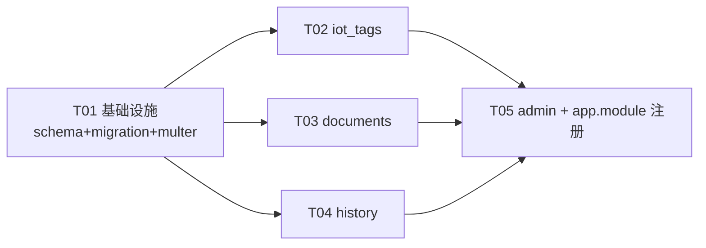

# HomeHub 后端 4 模块系统设计

> 架构师：Bob（高见远）　|　范围：`iot_tags` / `documents` / `history` / `admin` 四个后端模块
> 设计依据：已通读 `server/src` 现有模块（trigger / stock / dashboard / units / brands / plugins）与全部 DB schema，非凭空假设。

---

## 1. 文件列表（完整相对路径，标注新建/修改）

### 1.1 iot_tags 模块（RFID 硬件管理）— 全新建

| 文件 | 状态 | 说明 |
|------|------|------|
| `server/src/modules/iot_tags/dto/iot-tag.dto.ts` | 新建 | Reader/Zone 的 Create/Update DTO |
| `server/src/modules/iot_tags/iot-tags.service.ts` | 新建 | RFID Reader + Zone CRUD，记录 lastOnlineAt |
| `server/src/modules/iot_tags/iot-tags.controller.ts` | 新建 | 两个 Controller：`@Controller('rfid-readers')` + `@Controller('rfid-zones')` |
| `server/src/modules/iot_tags/iot-tags.module.ts` | 新建 | 注册 controllers + service，export service |

> 复用 `db/schema/trigger.ts` 中的 `rfidReaders` / `rfidZones`，**不新建表**。

### 1.2 documents 模块（文档附件管理）— 新建 + DB schema + migration

| 文件 | 状态 | 说明 |
|------|------|------|
| `server/src/db/schema/documents.ts` | 新建 | `documents` 表定义 |
| `server/src/db/schema/index.ts` | 修改 | 增加 `export { documents } from './documents'` |
| `server/src/db/migrations/0003_documents.sql` | 新建 | migration SQL（由 `drizzle-kit generate` 生成，附手工兜底 SQL） |
| `server/src/db/migrations/meta/_journal.json` | 修改 | 追加 idx=3 entry（generate 自动完成） |
| `server/src/modules/documents/dto/document.dto.ts` | 新建 | 查询/响应 DTO（上传用 multipart，无需 CreateItemDto 式 body DTO） |
| `server/src/modules/documents/documents.service.ts` | 新建 | CRUD + 文件落盘 `uploads/documents/` + 下载流 |
| `server/src/modules/documents/documents.controller.ts` | 新建 | upload / list / get / download / delete |
| `server/src/modules/documents/documents.module.ts` | 新建 | 注册 + export |

### 1.3 history 模块（操作日志/审计）— 全新建，无新表

| 文件 | 状态 | 说明 |
|------|------|------|
| `server/src/modules/history/dto/history.dto.ts` | 新建 | Timeline 过滤 + 分页查询 DTO |
| `server/src/modules/history/history.service.ts` | 新建 | 聚合查询 stockTransactions + scanLogs |
| `server/src/modules/history/history.controller.ts` | 新建 | 两个 Controller：`@Controller('items')`（item 历史）+ `@Controller('history')`（timeline/scan-logs） |
| `server/src/modules/history/history.module.ts` | 新建 | 注册 + export |

> 复用 `stockTransactions` / `scanLogs` / `items`，**不新建表**。

### 1.4 admin 模块（管理后台）— 全新建，无新表

| 文件 | 状态 | 说明 |
|------|------|------|
| `server/src/modules/admin/dto/admin.dto.ts` | 新建 | 响应类型定义（可选，轻量） |
| `server/src/modules/admin/admin.service.ts` | 新建 | 系统统计 + 用户/家庭/Token 列表 + 插件概览 |
| `server/src/modules/admin/admin.controller.ts` | 新建 | `@Controller('admin')`，5 个 GET 路由 |
| `server/src/modules/admin/admin.module.ts` | 新建 | 注册 + export；注入 `PluginRegistryService`（全局可用） |

### 1.5 共享/注册修改

| 文件 | 状态 | 说明 |
|------|------|------|
| `server/src/app.module.ts` | 修改 | imports 追加 IotTagsModule / DocumentsModule / HistoryModule / AdminModule |
| `server/package.json` | 修改 | 新增 `multer` 运行时依赖（`@types/multer` 已在 devDeps） |

---

## 2. 接口设计

> 全局前缀 `/api/v1`（见 `main.ts`）。所有路由均 `@UseGuards(AuthGuard('jwt'))`，从 `req.user` 取 `{ id, email, familyId }`（参考 `stock.controller.ts` 的 `AuthedRequest`）。

### 2.1 iot_tags — RFID Reader CRUD（`@Controller('rfid-readers')`）

| Method | Path | 说明 | Service 方法 |
|--------|------|------|--------------|
| GET | `/rfid-readers` | 列出当前家庭所有读卡器 | `listReaders(familyId: number)` |
| GET | `/rfid-readers/:id` | 获取单个读卡器 | `getReaderById(id: number)` |
| POST | `/rfid-readers` | 创建读卡器 | `createReader(familyId: number, dto: CreateReaderDto)` |
| PUT | `/rfid-readers/:id` | 更新读卡器 | `updateReader(id: number, familyId: number, dto: UpdateReaderDto)` |
| DELETE | `/rfid-readers/:id` | 删除读卡器 | `deleteReader(id: number, familyId: number)` |
| POST | `/rfid-readers/:id/heartbeat` | 上报在线，刷新 lastOnlineAt | `heartbeat(id: number, familyId: number)` |

### 2.2 iot_tags — RFID Zone CRUD（`@Controller('rfid-zones')`）

| Method | Path | 说明 | Service 方法 |
|--------|------|------|--------------|
| GET | `/rfid-zones` | 列出区域（可按 readerId 过滤） | `listZones(familyId: number, readerId?: number)` |
| GET | `/rfid-zones/:id` | 获取单个区域 | `getZoneById(id: number)` |
| POST | `/rfid-zones` | 创建区域 | `createZone(familyId: number, dto: CreateZoneDto)` |
| PUT | `/rfid-zones/:id` | 更新区域 | `updateZone(id: number, familyId: number, dto: UpdateZoneDto)` |
| DELETE | `/rfid-zones/:id` | 删除区域 | `deleteZone(id: number, familyId: number)` |

> Zone 通过 readerId 间接归属家庭（reader.familyId）。`listZones` 先按 familyId 过滤 readers 再 join zones，或直接在 service 内联校验。详见 §5 共享知识。

### 2.3 documents（`@Controller('documents')`）

| Method | Path | 说明 | Service 方法 |
|--------|------|------|--------------|
| POST | `/documents/upload` | multipart 上传（字段 `file` + body: itemId?, category?） | `upload(familyId: number, file: Express.Multer.File, meta: UploadMetaDto)` |
| GET | `/documents` | 列表，支持 `?itemId=` 过滤 | `list(familyId: number, itemId?: number)` |
| GET | `/documents/:id` | 获取元数据 | `getById(id: number, familyId: number)` |
| GET | `/documents/:id/download` | 下载文件流 | `download(id: number, familyId: number, res: Response)` |
| DELETE | `/documents/:id` | 删除文件 + 记录 | `delete(id: number, familyId: number)` |

### 2.4 history

**`@Controller('items')`**（物品历史，与 stock 的 `/stock/items/:id/history` 路径不冲突）

| Method | Path | 说明 | Service 方法 |
|--------|------|------|--------------|
| GET | `/items/:id/history` | 单物品完整变更记录（stockTransactions WHERE itemId） | `getItemHistory(itemId: number)` |

**`@Controller('history')`**

| Method | Path | 说明 | Service 方法 |
|--------|------|------|--------------|
| GET | `/history/timeline` | 家庭级时间线，支持 type/source/dateRange 过滤 + 分页 | `getFamilyTimeline(familyId: number, filters: TimelineQueryDto, pagination: PaginationQuery)` |
| GET | `/history/scan-logs` | 扫描日志列表 | `getScanLogs(familyId: number, limit?: number)` |

### 2.5 admin（`@Controller('admin')`）

| Method | Path | 说明 | Service 方法 |
|--------|------|------|--------------|
| GET | `/admin/stats` | 系统统计（总用户/家庭/物品/扫描次数） | `getSystemStats()` |
| GET | `/admin/users` | 用户列表（剔除 passwordHash） | `listUsers()` |
| GET | `/admin/families` | 家庭列表 + 每家庭成员数 | `listFamilies()` |
| GET | `/admin/tokens` | API Token 列表（剔除 tokenHash，可按 familyId 过滤） | `listApiTokens(familyId?: number)` |
| GET | `/admin/plugins` | 插件状态概览 | `getPluginOverview()` |

---

## 3. 数据结构（documents 新表 schema）

### 3.1 documents 表定义（`server/src/db/schema/documents.ts`）

```typescript
import { sqliteTable, text, integer } from 'drizzle-orm/sqlite-core';
import { families } from './users';
import { items } from './stock';

export const documents = sqliteTable('documents', {
  id: integer('id').primaryKey({ autoIncrement: true }),
  familyId: integer('family_id').notNull().references(() => families.id),
  itemId: integer('item_id').references(() => items.id, { onDelete: 'set null' }),
  name: text('name').notNull(),
  filePath: text('file_path').notNull(),
  mimeType: text('mime_type').notNull(),
  fileSize: integer('file_size').notNull(),
  category: text('category', {
    enum: ['warranty', 'manual', 'invoice', 'receipt', 'other'],
  }).notNull().default('other'),
  createdAt: integer('created_at', { mode: 'timestamp' }).notNull().$defaultFn(() => new Date()),
});
```

### 3.2 migration SQL（`0003_documents.sql`，兜底手工版）

```sql
CREATE TABLE `documents` (
	`id` integer PRIMARY KEY AUTOINCREMENT NOT NULL,
	`family_id` integer NOT NULL,
	`item_id` integer,
	`name` text NOT NULL,
	`file_path` text NOT NULL,
	`mime_type` text NOT NULL,
	`file_size` integer NOT NULL,
	`category` text DEFAULT 'other' NOT NULL,
	`created_at` integer NOT NULL,
	FOREIGN KEY (`family_id`) REFERENCES `families`(`id`),
	FOREIGN KEY (`item_id`) REFERENCES `items`(`id`) ON UPDATE no action ON DELETE set null
);
--> statement-breakpoint
CREATE INDEX `documents_family_id_idx` ON `documents` (`family_id`);
--> statement-breakpoint
CREATE INDEX `documents_item_id_idx` ON `documents` (`item_id`);
```

> **推荐**：先写好 schema 文件并加入 `index.ts` 导出，再执行 `npm run db:generate` 自动生成 migration + snapshot + journal（最稳）。上列 SQL 为无法运行 drizzle-kit 时的兜底。

### 3.3 类型导出（建议补到 `server/src/db/types.ts`）

```typescript
export type DocumentSelect = InferSelectModel<typeof schema.documents>;
export type DocumentInsert = InferInsertModel<typeof schema.documents>;
```

---

## 4. Service 方法签名（核心）

### 4.1 IotTagsService

```typescript
@Injectable()
export class IotTagsService {
  constructor(@Inject('DATABASE_CONNECTION') private readonly db: any) {}

  // Reader
  listReaders(familyId: number): Promise<any[]>;
  getReaderById(id: number): Promise<any>;
  createReader(familyId: number, dto: CreateReaderDto): Promise<any>;
  updateReader(id: number, familyId: number, dto: UpdateReaderDto): Promise<any>;
  deleteReader(id: number, familyId: number): Promise<{ success: true }>;
  heartbeat(id: number, familyId: number): Promise<any>;  // set lastOnlineAt = new Date()

  // Zone（通过 reader.familyId 归属家庭）
  listZones(familyId: number, readerId?: number): Promise<any[]>;
  getZoneById(id: number): Promise<any>;
  createZone(familyId: number, dto: CreateZoneDto): Promise<any>;
  updateZone(id: number, familyId: number, dto: UpdateZoneDto): Promise<any>;
  deleteZone(id: number, familyId: number): Promise<{ success: true }>;
}
```

### 4.2 DocumentsService

```typescript
@Injectable()
export class DocumentsService {
  constructor(@Inject('DATABASE_CONNECTION') private readonly db: any) {}

  upload(familyId: number, file: Express.Multer.File, meta: UploadMetaDto): Promise<DocumentSelect>;
  list(familyId: number, itemId?: number): Promise<DocumentSelect[]>;
  getById(id: number, familyId: number): Promise<DocumentSelect>;
  download(id: number, familyId: number, res: Response): Promise<void>;
  delete(id: number, familyId: number): Promise<{ success: true }>;
}
```

### 4.3 HistoryService

```typescript
@Injectable()
export class HistoryService {
  constructor(@Inject('DATABASE_CONNECTION') private readonly db: any) {}

  getItemHistory(itemId: number): Promise<any[]>;  // stockTransactions WHERE itemId ORDER BY createdAt DESC
  getFamilyTimeline(familyId: number, filters: TimelineQueryDto, pagination: PaginationQuery): Promise<PaginationResponse<any>>;
  getScanLogs(familyId: number, limit?: number): Promise<ScanLogSelect[]>;
}
```

### 4.4 AdminService

```typescript
@Injectable()
export class AdminService {
  constructor(
    @Inject('DATABASE_CONNECTION') private readonly db: any,
    private readonly pluginRegistry: PluginRegistryService,
  ) {}

  getSystemStats(): Promise<{ totalUsers: number; totalFamilies: number; totalItems: number; totalScans: number }>;
  listUsers(): Promise<Omit<UserSelect, 'passwordHash'>[]>;
  listFamilies(): Promise<Array<FamilySelect & { memberCount: number }>>;
  listApiTokens(familyId?: number): Promise<Array<Omit<ApiTokenSelect, 'tokenHash'>>>;
  getPluginOverview(): Promise<any[]>;  // 委托 pluginRegistry.listPlugins()
}
```

---

## 5. 共享知识（跨文件约定）

1. **DB 注入方式**：统一用 `@Inject('DATABASE_CONNECTION') private readonly db: any`（与 trigger / dashboard / units / brands 一致）。查询收尾用同步式 `.get()` / `.all()`（better-sqlite3）。`DATABASE_TOKEN === 'DATABASE_CONNECTION'`，如需 PG 兼容可改 `@Inject(DATABASE_TOKEN) db: Database` 并去掉 `.get()/.all()`（参考 stock 模块），但本批 4 模块为保持一致性沿用 `any` 模式。
2. **Controller 模式**：`@Controller('xxx')` + `@UseGuards(AuthGuard('jwt'))`，从 `req.user.familyId` / `req.user.id` 取上下文（参考 `stock.controller.ts` 的 `AuthedRequest`）。
3. **Module 模式**：`@Module({ controllers, providers, exports })`，service 同时 export 供其他模块注入。
4. **DTO 验证**：`class-validator` 装饰器（`@IsString/@IsNumber/@IsEnum/@IsOptional`），全局 `ValidationPipe` 已开 `whitelist+forbidNonWhitelisted+transform`（见 `main.ts`），分页复用 `common/dto/pagination.dto.ts` 的 `PaginationQuery` / `PaginationResponse`。
5. **时间戳**：DB 存 integer（unix ms），Drizzle `{ mode: 'timestamp' }` 自动转 `Date`。
6. **文件上传目录**：物理目录 `server/uploads/documents/`（`main.ts` 已把 `uploads/` 挂到静态前缀 `/uploads`）。Service 在 upload 前用 `fs.mkdirSync(dir, { recursive: true })` 确保目录存在。`filePath` 存相对路径（如 `documents/uuid-name.pdf`），下载时拼 `join(__dirname, '..', 'uploads', filePath)`。
7. **multer**：`FileInterceptor('file', { storage: diskStorage({ destination: 'uploads/documents/', filename }) })`，`@UploadedFile() file: Express.Multer.File`。需先 `npm i multer`（`@types/multer` 已存在）。
8. **删除一致性**：documents delete 要先查记录拿 filePath → `fs.unlinkSync` 删物理文件 → 删 DB 记录；物理文件不存在时吞错继续删记录。
9. **admin 安全**：当前仅 JWT 鉴权（与全局一致），无角色守卫。`getSystemStats/listUsers/listFamilies` 为系统级聚合（跨家庭）。**待补**：建议后续加 RolesGuard 限制 family admin。本次不实现角色控制，仅 flag（见 §6）。
10. **pluginRegistry 注入**：`PluginsModule` 是 `@Global()`，admin 模块无需 imports 它，直接构造函数注入 `PluginRegistryService` 即可。

---

## 6. 待明确事项 / 假设

1. **【路由并存】** `GET /items/:id/history`（history 模块，`@Controller('items')`）与现有 `GET /stock/items/:id/history`（stock 模块）路径不同（前者无 `/stock` 前缀），**无 NestJS 路由冲突**。**假设**：保留 stock 现有路由不动（零破坏），history 模块新路由为规范入口，前端逐步迁移。如需统一，可让 `StockController.getItemHistory` 改为委托 `HistoryService`（本次不做，避免跨模块依赖）。
2. **【admin 鉴权】** admin 端点是否需要 family-admin 角色？当前代码库无 RolesGuard。**假设**：本期仅 JWT 鉴权，与其它模块一致；角色控制列为后续增强。
3. **【admin 范围】** `listUsers/listFamilies/getSystemStats` 为系统级（跨家庭），`listApiTokens(familyId?)` 默认按 `req.user.familyId` 过滤，支持 `?familyId=` 覆盖。**假设**：调用方为可信管理端。
4. **【documents itemId】** 可空，支持"独立文档"（如家庭级说明书）。**假设**：itemId 非空时需校验归属同一 family（service 内 join items 校验，本次实现含该校验）。
5. **【migration 生成】** 推荐 `npm run db:generate` 自动生成 `0003_*.sql` + snapshot + journal。若环境无法运行 drizzle-kit，使用 §3.2 兜底 SQL 并手工追加 `_journal.json` 的 idx=3 entry。
6. **【rfidZones 家庭归属】** zones 表无 familyId，通过 readerId→reader.familyId 间接归属。`listZones/deleteZone` 等需先校验 zone.readerId 对应 reader 属于当前 family（service 内 join 或两步查询）。

---

## 7. 依赖包列表（新增）

| 包 | 版本 | 用途 |
|----|------|------|
| `multer` | `^1.4.5-lts.1` | documents 文件上传运行时依赖（`FileInterceptor` 底层）。`@nestjs/platform-express` 已装但不含 multer 运行时；`@types/multer` 已在 devDeps |

> 安装：`cd server && npm i multer`。无其它新增包——Drizzle / class-validator / NestJS 平台均已就绪。

---

## 8. 任务列表（有序，含依赖，按实现顺序）

> 遵循硬性约束：≤5 任务、每任务 ≥3 文件、首任务为基础设施、依赖尽量扁平。

### T01 — 基础设施：documents DB schema + migration + multer 依赖
- **文件**：`server/src/db/schema/documents.ts`(新)、`server/src/db/schema/index.ts`(改)、`server/src/db/migrations/0003_documents.sql`(新/生成)、`server/src/db/migrations/meta/_journal.json`(改)、`server/package.json`(改)、`server/src/db/types.ts`(改，加 DocumentSelect/Insert)
- **依赖**：无
- **优先级**：P0
- **验收**：`npm run db:generate` 成功或手工 SQL 可执行；`tsc --noEmit` 通过

### T02 — iot_tags 模块（RFID Reader + Zone CRUD）
- **文件**：`server/src/modules/iot_tags/dto/iot-tag.dto.ts`、`server/src/modules/iot_tags/iot-tags.service.ts`、`server/src/modules/iot_tags/iot-tags.controller.ts`、`server/src/modules/iot_tags/iot-tags.module.ts`
- **依赖**：T01（约定基础；不复用 documents 表，但保持同批风格统一）
- **优先级**：P0
- **验收**：5+5 路由可编译；list/create/update/delete 走通 rfidReaders/rfidZones

### T03 — documents 模块（文档上传/下载/CRUD）
- **文件**：`server/src/modules/documents/dto/document.dto.ts`、`server/src/modules/documents/documents.service.ts`、`server/src/modules/documents/documents.controller.ts`、`server/src/modules/documents/documents.module.ts`
- **依赖**：T01（documents 表 + multer）
- **优先级**：P0
- **验收**：upload→list→download→delete 全链路；文件落 `uploads/documents/`

### T04 — history 模块（操作时间线/审计聚合）
- **文件**：`server/src/modules/history/dto/history.dto.ts`、`server/src/modules/history/history.service.ts`、`server/src/modules/history/history.controller.ts`、`server/src/modules/history/history.module.ts`
- **依赖**：T01
- **优先级**：P1
- **验收**：item 历史 / family timeline（带过滤+分页）/ scan-logs 三接口可查

### T05 — admin 模块 + app.module.ts 注册全部 4 模块
- **文件**：`server/src/modules/admin/dto/admin.dto.ts`、`server/src/modules/admin/admin.service.ts`、`server/src/modules/admin/admin.controller.ts`、`server/src/modules/admin/admin.module.ts`、`server/src/app.module.ts`(改)
- **依赖**：T02、T03、T04（注册需 4 模块都已存在）
- **优先级**：P1
- **验收**：5 个 admin 路由可用；`app.module.ts` imports 含 4 新模块；整体 `tsc --noEmit` + 启动无错

---

## 9. 任务依赖图


